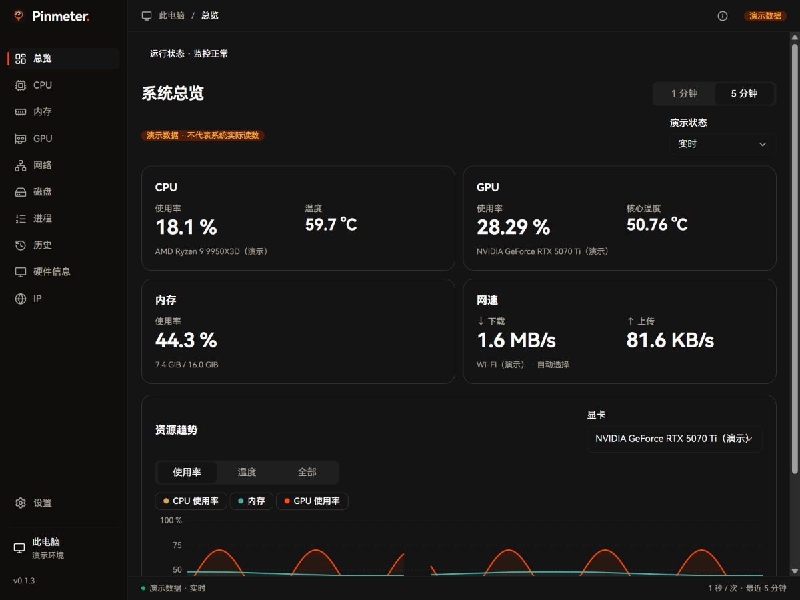

# Pinmeter


**简体中文** | [English](docs/README.en.md)

轻量的系统监控工具，在主窗口、系统托盘和 Windows 任务栏查看电脑状态。

正在准备 v0.1.3 Windows x64 预览版；可下载版本见[发布页](https://github.com/tsuixl/Pinmeter/releases)。macOS / Linux 尚未完成实机验收。

## 功能

- **系统监控**：四张资源卡查看 CPU、GPU、内存和网速，支持温度、磁盘读写与最近五分钟趋势。
- **任务栏与托盘**：自选读数、顺序和显卡，托盘快捷面板查看状态并进入详情。
- **进程排查**：按应用或进程查看 CPU/内存，支持搜索、固定、暂停、列排序与调宽，内存自动切换单位。
- **本地历史**：24 小时 / 7 天 / 30 天趋势、峰值和周期比较，应用流量明细、数据清理及 CSV 导出。
- **硬件信息**：查看处理器、显卡、内存、硬盘、显示器和网卡等设备信息。
- **应用网络**：按应用查看流量，设置上下行限速、禁用或恢复网络。
- **IP 检测**：查看公网出口、IP 资料、网络连通性和第三方服务状态。
- **个性化设置**：独立设置侧栏、深浅主题、系统字体及字面选择、启动到托盘和开机自启；普通偏好即时保存。
- **提醒与诊断**：默认关闭的 CPU/内存应用内提醒，以及主动开启的限时排障和本地诊断导出。

网络控制及代理 / VPN 场景仍在完善，已验证范围与已知限制见 [开发进度](docs/development/README.md)。

## 截图

总览为 v0.1.3 浏览器演示数据；任务栏为早期 Windows 实机参考图。点击图片可查看原图。

### 总览

[](docs/development/v0.1.0-main-window/assets/card-spread-dark.jpg)

### 任务栏

[](docs/development/v0.1.0-taskbar-display/assets/readme-taskbar-readouts.png)

## 使用

v0.1.3 发行附件（发布后可用）：[Windows 安装版](https://github.com/tsuixl/Pinmeter/releases/download/v0.1.3/Pinmeter_0.1.3_x64-setup.exe) · [Windows 便携版](https://github.com/tsuixl/Pinmeter/releases/download/v0.1.3/Pinmeter-0.1.3-preview-windows-x64.zip)。源码、校验文件及已知限制见[发布说明](https://github.com/tsuixl/Pinmeter/releases/tag/v0.1.3)。

Windows 启动时会请求管理员权限。CPU 温度等能力取决于硬件和驱动支持，缺少驱动时会提示原因。

需要 PawnIO 驱动时，在 CPU 页点击“下载安装驱动”，即可从[官方来源](https://pawnio.eu/)自动下载、校验并安装，完成后自动检测；需要联网和管理员权限，Pinmeter 不捆绑驱动安装器。

最小化后收起到托盘，点击托盘图标打开快捷面板，可从面板进入主窗口。关闭窗口时可选择最小化或退出；网络页和“运行状态”提供解除全部网络限制的入口。

预览版通过发布页手动下载安装；v0.1.1 没有更新客户端，需要手动升级。预览发行不推进稳定自动更新入口。实际安装升级、管理员、代理/VPN 和长期场景的未验证项见发布说明。

使用便携版时保留整个运行目录，切换版本前完全退出旧版。也可从源码构建：

```powershell
npm.cmd --prefix src/frontend ci
powershell -ExecutionPolicy Bypass -File tools/dev.ps1 build
```

需要 Node.js 24、Rust MSVC、Visual Studio C++ 工具和 WebView2，参见 [环境要求](https://v2.tauri.app/start/prerequisites/)。构建完成后会输出 `src/backend/target/testN/Pinmeter.exe` 的实际路径。

开发模式、检查命令和配置位置见 [开发约定](docs/development/README.md#本地运行与构建)。更多设计与实现说明见 [文档目录](docs/README.md)。

## 开源与致谢

Pinmeter 采用 [AGPL-3.0-only](LICENSE)。Copyright (C) 2026 Pinmeter contributors。第三方组件保留各自条款，详见 [第三方声明](src/backend/host/resources/legal/THIRD-PARTY-NOTICES.txt)和[源码说明](src/backend/host/resources/legal/SOURCE_CODE.txt)。

感谢 [Sakani](https://github.com/samzydd/Sakani-design-system) 的视觉与组件、[one-ip](https://github.com/zhihui-hu/one-ip) 的 IP 检测实现，以及 [Cindy](https://github.com/makecindy/cindy) 的窗口集成思路。硬件与网络能力使用 LibreHardwareMonitor、PawnIO、WinDivert；界面基于 React、Tauri、Lucide 和 Geist。

Windows 方案参考了 TrafficMonitor、System Informer、windows_exporter，网络控制参考了 Throttle、BandwidthDesk；来源和范围见 [方案调研](docs/research/windows-monitoring.md)及[网络控制说明](src/backend/platform/network-control/THIRD-PARTY-NOTICES.txt)。
