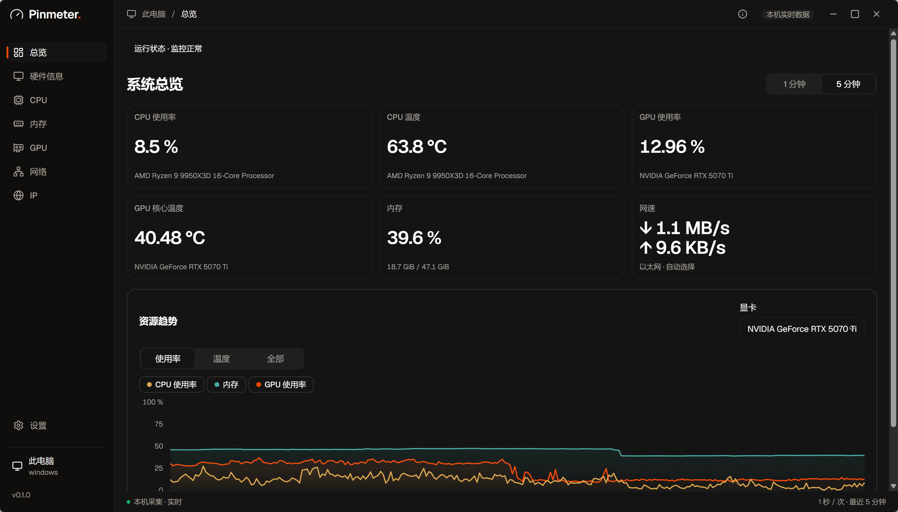

# Pinmeter

**简体中文** | [English](docs/README.en.md)

轻量的系统监控工具，在主窗口、系统托盘和 Windows 任务栏查看电脑状态。

目前优先支持 Windows，处于 v0.1.0 开发阶段，首个公开版本尚未发布；macOS / Linux 尚未完成实机验收。

## 功能

- **系统监控**：查看 CPU、内存、GPU、网速，以及设备支持的温度指标，保留最近五分钟趋势。
- **任务栏显示**：用双行紧凑读数查看常用指标，支持托盘常驻。
- **硬件信息**：查看处理器、显卡、内存、硬盘、显示器和网卡等设备信息。
- **应用网络**：按应用查看流量，设置上下行限速、禁用或恢复网络。
- **IP 检测**：查看公网出口、IP 资料、网络连通性和第三方服务状态。
- **个性化设置**：深浅主题、采样间隔、网卡选择和开机自启；操作后即时保存。

网络控制及代理 / VPN 场景仍在完善，已验证范围与已知限制见 [开发进度](docs/development/README.md)。

## 截图

v0.1.0 开发版 Windows 实机截图，点击图片可查看原图。

### 总览

[](docs/development/v0.1.0-main-window/assets/readme-overview-native-dark.png)

### 任务栏

[](docs/development/v0.1.0-taskbar-display/assets/readme-taskbar-readouts.png)

## 使用

Windows 启动时会请求管理员权限。CPU 温度等能力取决于硬件和驱动支持，缺少驱动时会提示原因。

最小化后收起到托盘，点击托盘图标可恢复窗口。关闭窗口时可选择最小化或退出；网络页和“运行状态”提供解除全部网络限制的入口。

使用便携版时保留整个运行目录，切换版本前完全退出旧版。当前可从源码构建：

```powershell
npm.cmd --prefix src/frontend ci
powershell -ExecutionPolicy Bypass -File tools/dev.ps1 build
```

需要 Node.js 24、Rust MSVC、Visual Studio C++ 工具和 WebView2，参见 [环境要求](https://v2.tauri.app/start/prerequisites/)。构建完成后会输出 `src/backend/target/testN/Pinmeter.exe` 的实际路径。

开发模式、检查命令和配置位置见 [开发约定](docs/development/README.md#本地运行与构建)。更多设计与实现说明见 [文档目录](docs/README.md)。

## 开源与致谢

Pinmeter 采用 [AGPL-3.0-only](LICENSE)。Copyright (C) 2026 Pinmeter contributors。第三方组件保留各自条款，详见 [第三方声明](src/backend/host/resources/legal/THIRD-PARTY-NOTICES.txt)和[源码说明](src/backend/host/resources/legal/SOURCE_CODE.txt)。

感谢 [Sakani](https://github.com/samzydd/Sakani-design-system) 的视觉与组件、[one-ip](https://github.com/zhihui-hu/one-ip) 的 IP 检测实现，以及 [Cindy](https://github.com/makecindy/cindy) 的窗口集成思路。硬件与网络能力使用 LibreHardwareMonitor、PawnIO、WinDivert；界面基于 React、Tauri、Lucide 和 Geist。

Windows 方案参考了 TrafficMonitor、System Informer、windows_exporter，网络控制参考了 Throttle、BandwidthDesk；来源和范围见 [方案调研](docs/research/windows-monitoring.md)及[网络控制说明](src/backend/platform/network-control/THIRD-PARTY-NOTICES.txt)。
