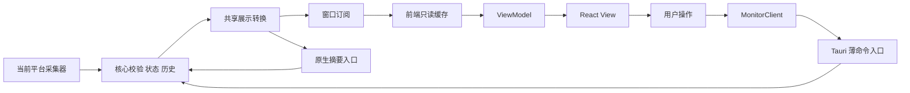

# Pinmeter 跨平台架构与代码组织

[文档目录](../README.md) / 技术架构

> 版本：v0.1 · 日期：2026-09-16 · 状态：实现前的架构基线草案。
>
> 用户已明确要求：从架构上考虑跨平台，并在实现前明确 MVC 等代码组织方式。本文给出分层、接口和依赖约束；v0.1.0 共享核心、平台适配及 React/Tauri 主窗口已落地。后续功能目录仍按需建立，平台与运行验证以各功能执行记录为准。

## 1. 架构选择

**整体采用模块化单体，核心采用接口与适配器分层，React 界面采用 MVVM 式组织和单向数据流。**

用三个问题理解这套设计：

1. **数据怎么算、状态怎么变？** 由跨平台 Rust 核心处理。
2. **数据从哪个系统接口读取、窗口如何显示？** 由 Windows、macOS、Linux 适配器处理。
3. **用户看见什么、点击后发出什么操作？** 由 View 与 ViewModel 处理。

主程序作为一个应用交付。首版不建立微服务、通用插件框架或依赖注入容器；只有硬件传感器、任务栏隔离验证或应用网络采集的权限隔离确有需要时，才引入对应功能规划中的辅助进程。应用网络排行采用按需只读 ETW 辅助进程，不引入常驻服务或流量控制驱动。独立的[应用网络控制](../development/v0.1.0-app-network-control/design.md)已接入 WinDivert 限速与系统防火墙适配，使用平台辅助进程；基础下载限速与新连接禁用/恢复已实测，其他场景待验收，不改变只读排行边界，不增加常驻 Pinmeter 服务。

### 1.1 MVC 与本项目的对应关系

MVC 将职责分为 Model（模型）、View（视图）和 Controller（控制器）。它能帮助区分界面与逻辑，但还需要补充系统适配、采样调度和后台状态的边界。

| 职责 | Pinmeter 中的实现 | 具体例子 |
| --- | --- | --- |
| Model：指标和业务状态 | Rust Domain + Application | 网络差分、数据过期、历史缓存、配置规则 |
| View：显示与输入 | React 组件；原生任务栏/菜单栏视图 | 指标行、曲线、设置表单、任务栏文字 |
| ViewModel：可显示状态与操作 | React feature hooks、选择器和界面状态 | `useMonitorViewModel`、`useSettingsViewModel` |
| Controller：外部操作入口 | Tauri 命令、原生菜单/窗口回调 | 解析请求、校验调用权限、调用用例 |

**前端使用 MVVM 式组织**：View 渲染 ViewModel 提供的状态，并调用它暴露的操作；ViewModel 通过统一客户端请求后端。这里的 MVVM 是代码职责约定，使用普通函数、hooks 和组件即可，不增加 MVVM 框架，也不引入双向绑定。

React 的 reducer 可将界面状态转换集中为纯函数；这是实现工具之一，不代表 React 官方强制采用 MVVM。[React 状态逻辑文档](https://react.dev/learn/extracting-state-logic-into-a-reducer)

### 1.2 实现前固定的规则

- 跨平台结构从 M0 开始；Windows 优先做深入验证只影响发布顺序。
- Rust 核心不依赖 Tauri、Win32、AppKit、桌面环境 API 或 `sysinfo` 的具体类型。
- 同一指标在同一运行环境只指定一个生产来源。
- 所有界面与原生入口共用后端用例、已确认配置和有效数据。
- 系统能力按运行环境探测，界面按能力展示；不以操作系统名称代替能力判断。
- 平台 API、数据口径、视觉呈现各自有边界，变更其中一项不要求重写其余部分。
- 界面遵循 [产品设计第 5.4 节](../design/product-design.md#54-视觉规范) 的 Sakani 强制标准；HTML 仅为布局参考，视觉库接入和替换不改变 ViewModel、采集与配置的业务职责。

## 2. 代码分层与依赖方向

下图中的箭头表示**代码依赖**，不是采样数据的流动方向。

```mermaid
flowchart TD
    VIEW[React View] --> VM[Feature ViewModel]
    VM --> CLIENT[MonitorClient 接口与只读缓存]
    BRIDGE[Tauri 客户端适配器] -. 实现 .-> CLIENT
    ENTRY[Tauri 命令与原生操作入口] --> APP[Application 用例]
    APP --> DOMAIN[Domain 指标与规则]
    APP --> PORTS[Ports 外部能力接口]
    PORTS --> DOMAIN
    ADAPTERS[平台采集 桌面与存储适配器] -. 实现 .-> PORTS
    ADAPTERS --> DOMAIN
    ROOT[启动装配模块] --> APP
    ROOT --> ADAPTERS
    ROOT --> ENTRY
```



跨语言的 `MonitorClient → Tauri 命令` 是通信边界，在第 6 节单独定义。外层适配器实现核心需要的接口，核心不会反向导入适配器。

### 2.1 各层职责

| 层 | 负责 | 不应包含 |
| --- | --- | --- |
| Domain | 项目自己的指标/设备标识、单位、口径、有效性、通用差分和断档规则 | 系统调用、窗口句柄、网络通信、文件路径、UI 组件 |
| Application | 采集计划、来源选择、样本接纳、历史与快照、配置用例、能力决策 | Win32 调用、React 状态、Tauri event/channel 类型 |
| Ports | 核心需要的采集、配置存储、时间和桌面操作契约 | 某系统专属参数或依赖的具体类型 |
| Adapters | 调用操作系统或第三方库，转换为项目类型，执行桌面与存储操作 | 自建第二份权威配置、绕开公共规则的历史或统计 |
| Presentation | ViewModel、组件、统一展示格式、原生读数与命令入口 | 重新计算真实网速/CPU、直接操作采集句柄 |
| Composition / Runtime | 创建依赖、注册命令、启动调度执行器、管理线程与退出 | 另写一套指标算法或业务配置规则 |

“采集计划”属于 Application：采什么、周期多长、失败是否退避。“执行计划”属于 Runtime：使用哪种定时器、工作线程和主线程调度机制。两者通过项目自己的任务与结果类型衔接。

### 2.2 前端与本地后端边界

源码先分为前端、本地后端和共享数据。本地后端随桌面应用在用户电脑运行，其内部再分核心逻辑、平台适配和薄宿主：

| 目录 | 职责 | 依赖边界 |
| --- | --- | --- |
| `src/frontend/` | React View、ViewModel、前端客户端与只读缓存 | 通过宿主协议访问能力，不包含系统采集或指标算法 |
| `src/backend/core/` | `pinmeter-core`：Domain、Application、Ports | 不依赖 UI、平台实现、宿主或桌面框架 |
| `src/backend/platform/` | `pinmeter-platform`：Windows/macOS/Linux 采集、原生入口、存储及时间适配 | 依赖核心的模型与接口、系统 SDK 和采集库，不依赖宿主或 Tauri |
| `src/backend/host/` | `pinmeter-host`：Tauri 装配、命令、DTO、投影转换、执行器与框架桥接 | 依赖核心和平台适配，不另写业务规则或原生采集实现 |

Rust 工作区使用 **三个 crate**，依赖为 `host → platform/core`、`platform → core`；UI 通过通信协议访问 host。各操作系统是平台 crate 内的模块，不为每个接口或指标继续拆 crate。

Tauri 通用窗口/托盘操作留在宿主桥接中，原生任务栏、平台采集和能力探测放在平台层。`DesktopIntegration` 由宿主组合两部分；平台层消费核心定义的摘要和操作意图，通过窄接口或回调交互，不导入宿主 DTO 或持有 `AppHandle`。宿主将前端协议转换为核心类型，平台层不创建第二份应用状态。

主窗口使用一体化标题栏，具体方案见 [main-window](../development/v0.1.0-main-window/design.md#标题栏一体化)。View 呈现顶部、按钮及交互区域；ViewModel 组织最大化等只读窗口状态与操作；前端客户端适配器封装 Tauri 窗口 API 和事件，View 不直接导入或调用。实际窗口是窗口状态来源，主题仍取后端已确认设置，标题栏不维护第二份偏好。宿主负责各平台窗口配置、权限与生命周期，纯窗口操作不为此增加核心业务抽象；确需原生平台补充时在 platform 内隔离系统依赖，经 host 桥接。窗口操作通过 Tauri 能力实现并逐平台验证。

通用 `sysinfo` 封装由各平台组合使用。原生文字绘制属于平台显示适配，仅消费共享投影；指标算法仍由核心处理，交互与视觉要求遵循产品设计。

2026-09-17 [任务栏显示设计](../development/v0.1.0-taskbar-display/design.md) 细化此边界：原生摘要分发独立于主窗口订阅和可见性，平台只接收项目摘要与有限操作意图；先验证当前提权宿主与 Explorer 的权限/DPI 组合，再确定同进程原生线程或仅绘制 helper。后者只在隔离确有必要时引入，不建立新的采样源。窗口关闭选择与明确退出分别处理，退出仍复用网络限制清理用例；当前已接入同进程原生线程、单槽摘要和托盘/退出入口；普通权限探针已验证，管理员正式宿主仍未验收，不能据此确认同进程兼容性。

## 3. 跨平台边界

### 3.1 共享什么，分别实现什么

| 能力 | 共享部分 | Windows 适配 | macOS 适配 | Linux 适配 |
| --- | --- | --- | --- | --- |
| CPU / 内存 / 网络 | 指标契约、来源选择、差分规则、状态和历史 | 原生 API 基础采集 | 首先评估 `sysinfo`，缺口局部补充 | 首先评估 `sysinfo`，缺口局部补充 |
| 进程 / 磁盘 | 查询条件、结果模型、可见时采集策略 | Toolhelp / 进程时间与工作集、PDH PhysicalDisk | P1 暂不支持，保留契约 | P1 暂不支持，保留契约 |
| 应用网络排行 | 应用归并、速率/占比、本次累计、会话与有效性 | 独立 ETW 辅助进程，继承启动时统一权限 | 首期不支持，保留契约 | 首期不支持，保留契约 |
| 应用网络控制（待实机验收） | 目标身份、限速/禁用规则、期望与实际状态、修订号 | WinDivert 限速 + 系统防火墙禁用适配；继承统一权限，独立于排行生命周期 | 首期不支持 | 首期不支持 |
| 详细窗口 / 悬浮窗 | React 组件、ViewModel、主题与用户意图 | 窗口行为适配 | 窗口与桌面空间行为适配 | 按桌面环境、会话类型适配 |
| 常驻入口（后续） | 摘要数据、打开面板/设置/退出用例 | 托盘；任务栏文字为专属扩展 | 菜单栏入口；文字能力单独验证 | 支持的托盘/菜单；缺失时保留窗口入口 |
| 高级传感器 | 可选能力模型、错误状态 | Windows LHM CPU helper | 按硬件与系统另行选型 | 按硬件与系统另行选型 |
| 配置与启动 | 设置结构、校验与迁移规则 | 本地目录、启动项及系统行为 | 本地目录、启动项及系统行为 | 本地目录、启动项及系统行为 |

表中是实现分工，不是现有兼容性承诺。Windows 的任务栏嵌入不映射为其他平台必须具备的同名功能；各平台使用适合自己的入口消费同一份摘要。

### 3.2 能力模型

能力不能只是一项 `isWindows` 或 `supported: true`。至少区分：

| 维度 | 例子 | 用途 |
| --- | --- | --- |
| 构建包含 | 本安装包是否编入 Windows 任务栏模块 | 判断该版本有没有提供者 |
| 平台支持 | 当前平台是否存在对应实现 | 明确功能范围 |
| 当前可用 | 可用、缺权限、缺驱动、接口失效、环境不支持 | 显示具体原因，允许恢复 |
| 用户偏好 | 用户是否希望显示或启用 | 不因临时不可用就丢失偏好 |
| 实际状态 | 生效、应用中、不可用 | 避免设置保存后假装系统操作已成功 |

桌面能力拆为 `tray`、`panelActivation`、`floatingWindow`、`alwaysOnTop`、`positioning`、`inlineSummary` 等少量独立字段。定位方式可区分精确定位、由窗口管理器决定、不可用；摘要入口可区分 Windows 任务栏和 macOS 菜单栏。

设备、显示器、权限或桌面会话变化时，由对应适配器重新探测相关能力，带版本号通知界面。Tauri 文档明确 Linux 的托盘鼠标事件有差异，因此公共交互必须保留菜单项入口。[Tauri 托盘文档](https://v2.tauri.app/learn/system-tray/)

### 3.3 编译隔离与运行时选择

- `cfg(target_os)` 和 Cargo 的目标依赖隔离 Windows、macOS、Linux 代码。
- Cargo feature 仅控制可选增强模块；不使用 feature 假装目标系统。
- 运行时探测负责判断当前设备、驱动、权限及桌面环境能否使用已编译功能。
- Windows 类型、原生句柄和 `sysinfo::System` 不穿过适配器边界；界面只接触项目 DTO。
- 前端按 capabilities 决定操作是否可用；平台名称可以用于说明文字，业务规则不能散落在组件的系统判断中。

Rust 官方提供按目标系统等配置进行条件编译的机制；是否运行可用仍需应用自行检测。[Rust 条件编译](https://doc.rust-lang.org/reference/conditional-compilation.html)

### 3.4 指标语义共享

共同字段不意味着各系统的内存、CPU 或设备统计天然一致。适配器必须标注来源、单位和 `semantic_id`：CPU 忙碌时间与 Utility 分开，内存 available 的平台含义在详情保留说明，网卡身份在平台内稳定映射。

采集结果分为两类：

- **Gauge（当前读数）**：系统已经计算好的 CPU 百分比、内存量等。共享核心验证范围和状态，不再次做时间差分。
- **Counter（累计计数）**：网卡累计字节等。共享核心按真实间隔计算速率；接口重连或计数回退重建基线。

PDH 查询所需的前后样本由 Windows 适配器管理；共享网络速率规则由 Domain 管理。不同 UI 均不重复计算这些指标。

## 4. 接口与用例

### 4.1 四类必要接口

以下为概念签名，类型在实现阶段定义；它们不要求一方法一对象。

| 接口 | 核心操作 | 实现与约束 |
| --- | --- | --- |
| `MetricProvider` | 探测能力、读取一批指定指标、重建原生基线、关闭 | Windows 基础、通用 sysinfo、可选传感器等少量提供者；每项结果独立有效性 |
| `SettingsRepository` | 加载、按版本保存 | 本地配置文件适配器；原子写入，迁移和参数规则由核心决定 |
| `DesktopIntegration` | 查询能力、执行打开/显隐等意图、提交摘要 | 各平台组合托盘/菜单栏/窗口/专属摘要入口；实际执行结果返回应用层 |
| `Clock` | 单调时间、展示时间 | 生产时钟和测试时钟；不使用墙上时间计算网速 |

采集提供者拥有自己的系统对象和原生句柄，并在固定执行上下文中使用；需要线程绑定的接口不被强行标为 `Send + Sync`。桌面适配器负责把窗口操作转发到所需主线程。

### 4.2 Application 对外用例

| 用例 | 输入 | 输出 / 效果 |
| --- | --- | --- |
| 查询监控状态 | 指标范围 | 同一版本的快照、能力和已确认设置 |
| 订阅 / 取消订阅 | 调用窗口、范围 | 订阅句柄与有序更新；不增加采样源 |
| 查询历史 | 指标、设备、时间范围或游标 | 有上限的样本、断档和保留边界 |
| 更新设置 | 修改项、期望配置版本 | 校验后的新版本、实际应用状态或错误 |
| 执行桌面操作 | 打开/激活主窗口、最小化、恢复可见区域等意图；后续扩展面板 | 能力检查与适配器执行结果 |
| 应用生命周期 | 启动、恢复、显示环境变化、退出 | 重建基线、恢复入口、停止采集和释放资源 |

Tauri 命令只做调用者检查、DTO 转换、调用用例和错误映射。原生任务栏或托盘点击调用同一套用例；不绕过参数校验、不直接写配置。Tauri commands 支持参数、结果与错误返回，适合作为这一薄入口。[Tauri 命令文档](https://v2.tauri.app/develop/calling-rust/)

2026-09-17 最新关闭规则：系统关闭与自绘按钮经宿主统一进入关闭选择状态，默认询问最小化或退出；核心 Settings.close_action 持有 ask/minimize/exit，原子保存成功后才执行记住的选择。托盘入口独立于任务栏直显，最小化确认入口可用后隐藏窗口及任务栏按钮，注销 UI 订阅但保留有界采集历史，恢复重新订阅；重复启动激活已有主窗口。taskbar-display 默认关闭，启用后创建原生摘要消费者，与始终保留的托盘及关闭选择独立；明确退出仍走公共清理用例。任务栏系统兼容及完整常驻验收单独记录。

## 5. 状态归属与执行模型

### 5.1 唯一状态来源

| 状态 | 所有者 | 其他部分如何使用 |
| --- | --- | --- |
| 已接纳样本、有效时间、序号、有限历史 | Rust Application | React / 原生入口读取投影 |
| 已确认的用户偏好、配置版本 | Rust Application，Repository 持久化 | 窗口持有只读副本，通过用例修改 |
| 能力、当前可用性和实际启用状态 | Rust Application 汇总适配器结果 | 界面展示，不自行推断权限或支持 |
| 系统计数器、设备句柄及平台采样基线 | 对应 MetricProvider | 只输出项目观测类型，不向 UI 暴露 |
| 调度时钟、线程、订阅连接、原生窗口对象 | 宿主 Runtime / 适配器 | 执行核心计划、回报结果 |
| 表单草稿、选中页、展开项、请求中状态 | 各 React ViewModel | 仅属于该界面；保存后以后端确认结果为准 |
| UI 快照和历史缓存 | 前端只读 store | 仅用于显示，可销毁和重新获取 |

CPU 逻辑处理器列表由 Rust Application 持有唯一当前快照，按项目定义的稳定编号维护逐项有效性；宿主通过状态 DTO 传递，ViewModel 处理连接失效后的展示。列表不复制到五分钟历史，各窗口不新增采集源。Windows 复用同一 PDH 查询，macOS/Linux 复用同一 sysinfo 刷新；平台类型不穿过核心边界。具体契约见 [basic-monitoring](../development/v0.1.0-basic-monitoring/design.md)。

### 5.2 采集与并发

硬件信息使用独立的一次启动任务：core/hardware 定义清单与状态，platform/hardware 执行固定 Windows 查询并限制输出、超时与退出取消，host 持有核心状态并通过只读命令投影。前端 hardware ViewModel 只在加载期间重读缓存状态，完成后停止；切页不重新采集。GPU 容量和 CPU 型号消费已有权威来源，不将静态清单放入高频快照或性能历史。见 [hardware-info](../development/v0.1.0-hardware-info/design.md)。

IP 检测采用独立按需任务：core 的 IP 用例持有唯一结果、有效时间和缓存，出口探测与资料查询分为两个能力端口；网络连通性、AI 访问和官方服务状态按三个独立组管理采样、代次及冷却。platform 封装固定目标、HTTP、上游字段和系统代理，host 在基础采样线程之外执行，结果经串行状态入口按会话/网络/查询代次接纳。所有 IP 页请求共用最多四个并发任务，出口及资料至多占两个；各组可以单独刷新，离页统一取消。网络请求不持有基础状态锁，取消和退避集中管理；数据不进入五分钟性能历史。前端用窄 IpClient 消费既有快照/订阅的 IP 投影，不重复创建权威缓存或请求循环。详见 [ip-inspection](../development/v0.1.0-ip-inspection/design.md)，已完成本地实现，代理平台能力与验证限制见执行进度。

[应用网络排行](../development/v0.1.0-app-network-ranking/design.md)使用独立按需来源，不替代网卡总量采集。平台将事件归属与窗口字节量转成项目观测，core 维护唯一应用汇总与有效状态，复用当前快照订阅，不向基础五分钟历史复制全部进程数据。事件消费不阻塞基础采样，缓冲与元数据缓存有界。用户开始后切页、最小化和界面重连保留同一采集会话，隐藏界面只停止推送与绘图；明确停止或实际采集失败结束本次采集。Windows 在本次应用运行期间保留已授权的空闲辅助进程以复用权限，停止时释放 ETW 会话、退出时结束辅助进程；重新开始使用新的代次，旧样本不进入新会话。默认关闭，重启不自动采集；完整采集与生命周期验收见原功能记录。

- 后端用一个串行状态处理入口接纳样本和配置命令，保证序号与版本一致；采用有界消息队列，不共享可随处修改的全局状态。
- 系统读取在提供者自己的执行器中完成。CPU / 网卡与慢传感器分开，状态处理入口不等待一次阻塞硬件调用结束。
- 每个提供者同一时刻至多一轮采集。超时标记该项失效并退避；仍在运行的阻塞调用不靠不断新建线程绕过。
- Application 决定采样计划与退避，Runtime 负责执行与计时。调用迟到后，按会话、配置代次和设备代次判断是否接纳。
- 有效采样时间由确认有效的数据推进；失败时可以保留旧读数，但必须有独立状态。
- 历史按时间、序列数量和点数限制；高基数的进程数据按需取样，不为所有进程持续保存全套曲线。
- 退出时停止新任务、注销订阅，按提供者的关闭协议释放资源；可选辅助进程单独管理退出和重连。

### 5.3 设置更新与多窗口

设置修改携带 `expected_revision`。后端校验、串行处理并原子保存；持久化失败时不发布新的已确认配置。版本冲突或写入失败时，ViewModel 恢复已确认值并显示原因。

设置更新由控件操作直接触发，宿主原子保存后返回已保存 Settings DTO；客户端只合并后端确认的较新配置，同一会话旧采样批次不能回退配置版本。正在保存时防止重复写入；失败恢复已确认值，规则见 [preferences](../development/v0.1.0-preferences/design.md)。

设置写入使用独立串行门，覆盖前端、原生任务栏与记住关闭选择。核心拆为准备、执行和接纳结果：仅校验及接纳短暂持有监控状态锁，自启注册、原子存储及补偿在锁外进行；保存期间继续接纳新样本，完成时只更新配置和相关基线，不替换整个 Monitor。退出先禁止新设置操作，在工作线程等待已接纳保存完成后读取最终退出偏好；主事件循环和采样线程不等待慢设置操作。

用户偏好与系统实际状态分开。例如“希望置顶”可已保存，但系统设置置顶失败时返回不可用状态，界面不得显示“已生效”。持久化成功后的系统副作用通过同一用例跟踪，所有窗口收到同一配置版本及实际应用结果。

开机自启按 [preferences](../development/v0.1.0-preferences/design.md) 采用可撤销注册：核心先验证设置与版本，经 `Autostart` 端口保存不透明检查点，再注册/移除系统任务并保存配置；失败恢复原任务，恢复失败单独报告。平台负责当前用户计划任务及实际状态，宿主在阻塞工作线程执行设置用例，UI 通过既有 ViewModel 即时提交。Windows 登录任务继承已授权的最高权限，手动启动仍使用原 UAC 流程；其余平台明确尚不支持。

同一窗口能力或采集配置的副作用串行执行，尚未开始的旧操作可合并为最新意图；互相独立的能力可并行。执行结果携带配置版本。已开始的旧操作若迟到完成，除了不覆盖新版本状态，还必须再次按最新偏好对齐系统实际状态；不能仅丢弃旧回执，却留下旧的置顶或采样周期。

## 6. 界面通信与单向数据流

### 6.1 运行时数据流

下图表示数据和操作如何流动，与第 2 节的代码依赖图含义不同。



### 6.2 命令与订阅协议

宿主定义以下小型通信面；名称为实现约定：

- `get_monitor_state`：读取当前快照、能力与配置版本。
- `subscribe_monitor` / `unsubscribe_monitor`：按窗口建立或注销订阅。
- `ack_monitor_batch`：确认界面已接纳的批次，配合应用层队列上限。
- `get_history`：按指标范围和游标补取有限历史。
- `update_settings`：提交带版本的设置修改。
- `perform_desktop_action`：执行枚举化的用户意图。
- IP 功能增加 `set_ip_view_active`、`refresh_ip` 与 `refresh_ip_checks`：按调用窗口登记可见需求、触发全页或指定检测组的有界刷新；分组只接受固定枚举，不接受任意外部 URL。IP 快照在 bootstrap/恢复时完整提供，后续按独立修订号随既有订阅传送变化，不每秒重发资料；沿用 ACK/背压边界，详见 [IP 契约](../development/v0.1.0-ip-inspection/design.md)。

请求使用 Tauri commands；持续监控数据优先用每个窗口独立的 Channel。官方说明 Channel 面向有序数据传递，但序号恢复、缓存上限和背压由 Pinmeter 自行定义，不能将通道等同于持久消息队列。[Tauri 通信文档](https://v2.tauri.app/develop/calling-frontend/)

订阅规则：

1. 在同一个状态处理入口建立订阅，取得历史游标 `S` 及一致的当前状态。首个 Channel 消息是 `Bootstrap`，包含订阅 ID、会话 ID、截至 `S` 的快照/所需历史、配置与能力版本。
2. **区分两种序号**：`delivery_seq` 在每个订阅内对实际发送的消息递增，用于顺序与 ACK；`history_cursor` 标识后端历史接纳位置，用于补取和去重。配置/能力变化也会发送新的消息，即使历史游标没有变化。
3. 历史按订阅范围筛选，未订阅的指标可使全局历史游标跳跃，因此不能只看游标差值判定丢样本。消息携带其历史覆盖边界；合并导致未包含全部目标样本时显式标记 `requires_history_sync`。
4. 每订阅限制在途批次与待发送最新快照；ACK 确认该订阅已接纳的 `delivery_seq`，不是确认所有历史已补齐。消费过慢时合并待发送快照，长时间不确认时释放订阅；不能无界调用 Channel 发送。
5. 收到补齐标记时，用最近已完整同步的历史游标调用 `get_history`，按返回的覆盖边界推进历史游标。已淘汰区间明确返回缺失，不能插值伪造峰值或连续性。传输批次真正不连续时重新订阅。
6. 每个窗口只建立一个共享客户端会话，多个 feature hooks 复用它。窗口隐藏、销毁或连接失败时，由宿主清理；React 卸载时也释放客户端引用。
7. 恢复显示、订阅超时或连接恢复后，重新执行 `subscribe_monitor` 并接收新的 `Bootstrap`；丢弃旧订阅迟到消息与 ACK，然后继续增量更新。只补取一次历史不能代替恢复订阅。
8. 指标、设备或订阅范围变化时重新建立相应视图基线；不把旧设备、旧会话的数据接到新曲线上。命令返回和 Channel 消息不构成两套更新时序，Bootstrap/Update 是订阅状态的来源。

### 6.3 DTO 与展示一致性

- 通信 DTO 定义在 Rust 宿主的 `contracts` 中，作为唯一类型来源，生成 TypeScript 类型；不手写两份独立演进的协议。
- DTO 不包含原生句柄、`sysinfo` 类型、文件对象或内部锁；原生标识映射为不透明项目 ID。
- 协议携带版本、会话、序号、来源及语义。大整数计数和序号使用十进制字符串，避免 JavaScript 精度损失。
- 单位缩放、舍入、缺失值状态等共用 Rust `presenters` 的纯转换；输出数值/单位 token、状态码和必要的原始值。React 与原生绘制复用转换结果，布局、字体、换行由各视图决定。
- 用户修改单位、主题或显示项会重新生成投影，不改变历史原始指标。状态文字根据稳定状态码展示，避免业务逻辑依赖中文字符串。
- 各窗口只能订阅其获准的数据范围。命令来源由宿主判断，不信任前端自行传入的窗口名；Tauri 权限与应用层校验共同控制入口。[Tauri capabilities](https://v2.tauri.app/security/capabilities/)

### 6.4 一个具体调用例子

用户在设置中将刷新间隔改为 2 秒：

```text
SettingsView
  → useSettingsViewModel：更新表单草稿并提交
  → MonitorClient.updateSettings：携带 expected_revision
  → Tauri command：检查调用者并转换 DTO
  → Settings 用例：校验 2 秒、检查版本、持久化偏好
  → Monitoring 用例：更新计划并跟踪实际应用状态
  → Runtime：让当前平台提供者在安全边界采用新周期
  → 窗口与原生入口：收到同一版本的确认/实际状态
```

整个流程不需要 React 知道当前采集器来自 Windows PDH 还是 macOS/Linux 的 `sysinfo`。

## 7. 工程目录规范

P1 扩展按功能归属：`core/src/disk.rs`、`processes.rs`、`archive.rs` 分别维护磁盘短历史、进程差值排行和分钟历史规则；同名 platform 模块封装 Windows API 或文件操作；同名 host 模块只管理工作线程、权限与 DTO。界面归属 `features/disk/`、`features/processes/`、`features/history/`，复用 `features/monitoring/` 的图表。磁盘和进程使用可见窗口的五秒轮询租约，切页后及时停止，不依赖浏览器退出清理成功；归档只消费现有基础帧及原始网络增量，不引入第二采样源。

目标是让根目录只承担项目入口职责。以下为建工程时的基线，**按实际需要创建，本次不建立空工程或占位目录**。

### 7.1 根目录允许项

```text
Pinmeter/
├─ README.md                       # 项目入口
├─ AGENTS.md                       # 完整开发规则
├─ AGENT.md                        # 兼容导航
├─ src/                            # 源码、工程配置与所属资源
├─ docs/                           # 设计、架构、调研、开发记录
├─ tools/                          # 构建、校验与发布辅助脚本
└─ .github/                        # 按需添加 CI 与 GitHub 配置
```

- 常规一级目录限定为 `src/`、`docs/`、`tools/`。仓库管理目录 `.git/` 由 Git 自行维护；`.github/` 在启用相关工具时创建。
- 根文件保留上述三个入口；`.gitignore`、`.gitattributes`、`.editorconfig` 和 `LICENSE` 按实际需要添加，分别承担仓库忽略、文本属性、编辑规范和许可证职责。
- `.gitattributes` 将文本检出统一为 LF，图标、截图和字体保持二进制，避免 Windows 自动换行转换让设计变量、生成契约与格式检查误报差异。
- 项目自有代码使用根 `LICENSE` 的 AGPL-3.0-only，第三方材料保留各自条款。发行用项目告知和源码获取说明位于 `src/backend/host/resources/legal/`，Tauri 通用资源映射原有许可文件到运行包 `licenses/`，不在根目录复制第三方许可集合。
- 应用清单、锁文件及构建配置随工程放入 `src/`，不散放在仓库根。更具体的位置见下文。
- 方案、截图、临时脚本、日志与测试报告不放根目录。不另建根级 `assets/`、`tests/`、`config/`、`scripts/` 等重复分类。
- 新增根目录项前先判断已有位置能否容纳；确有工具固定路径或工程需求时，先在本节记录用途和原因。普通功能增长应通过内部模块承接。

### 7.2 源码布局

```text
src/
├─ frontend/                       # React 前端
│  ├─ package.json                 # 同级保留选定包管理器的锁文件
│  ├─ index.html
│  ├─ vite.config.ts
│  ├─ tsconfig.json
│  ├─ src/
│  │  ├─ app/                      # 窗口入口与前端依赖装配
│  │  ├─ features/
│  │  │  ├─ monitoring/            # views、useMonitorViewModel、selectors
│  │  │  └─ settings/              # views、useSettingsViewModel
│  │  ├─ shared/                   # client、state、contracts、ui
│  │  └─ assets/                   # 参与构建的图片与字体
│  ├─ public/                      # 原样提供的静态资源，按需创建
│  └─ tests/                       # 界面与端到端测试及专用样本
├─ backend/                        # 本地后端
│  ├─ Cargo.toml                   # workspace：core、platform、host
│  ├─ Cargo.lock                   # 三个 Rust crate 共用锁文件
│  ├─ core/                        # 业务逻辑：pinmeter-core
│  │  ├─ Cargo.toml
│  │  ├─ src/
│  │  │  ├─ domain/                # 指标、单位、语义、状态与纯计算
│  │  │  ├─ application/           # monitoring/settings/desktop 用例
│  │  │  └─ ports/                 # 项目自己的外部能力接口
│  │  └─ tests/
│  ├─ platform/                    # 系统适配：pinmeter-platform
│  │  ├─ Cargo.toml
│  │  ├─ src/
│  │  │  ├─ lib.rs
│  │  │  ├─ windows/               # 采集、任务栏等 Windows 实现
│  │  │  ├─ macos/                 # 采集、菜单栏等 macOS 实现
│  │  │  ├─ linux/                 # 采集、桌面会话等 Linux 实现
│  │  │  └─ shared/                # sysinfo、存储、时钟等可复用适配
│  │  └─ tests/
│  └─ host/                        # 桌面宿主：pinmeter-host
│     ├─ Cargo.toml
│     ├─ build.rs
│     ├─ tauri.conf.json
│     ├─ capabilities/
│     ├─ icons/
│     ├─ tests/
│     └─ src/
│        ├─ bootstrap.rs           # 装配核心、平台实现和框架桥接
│        ├─ runtime/               # 执行器、消息队列、退出
│        ├─ commands/              # 薄命令入口
│        ├─ contracts/             # 前端 DTO、错误码、协议版本
│        ├─ presenters/            # Web 与原生共用展示转换
│        └─ bridges/               # Tauri 通用窗口/托盘等框架操作
└─ shared/                         # 跨模块共享数据，不承载业务逻辑
   ├─ design-tokens/
   └─ fixtures/
```

CPU 温度由 core 保存唯一当前值，并在接纳基础帧时冻结有效温度与状态，复用五分钟历史与既有订阅游标。CPU 温度的独立 C# helper 位于 platform/sensors，Rust 进程适配在 platform/src/temperature.rs；打包时通过 Windows 专用资源配置复制到 sensors 目录，Windows 主窗口在启动时统一请求权限，helper 默认采集并继承权限，不再提供温度授权命令。详见 [cpu-temperature](../development/v0.1.0-cpu-temperature/design.md)。

GPU 复用同一历史帧，core/gpu 保存设备与逐指标状态；platform/sensors/GpuProgram.cs 为继承宿主权限的独立 helper，platform/src/gpu.rs 负责有界读取、超时与退出。D3D 引擎/内存和厂商温度/频率由适配器转换为项目类型，host 只装配与投影，frontend/features/gpu 通过 ViewModel 选择设备和投影曲线。与 CPU 温度、应用网络采集进程分别管理，不新增界面采集来源；详见 [gpu-monitoring](../development/v0.1.0-gpu-monitoring/design.md)。

应用网络控制归属为 `core/src/app_network_control.rs`（规则、状态与端口）、`platform/src/app_network_control.rs`（规则文件与 Windows 进程适配）及 `frontend/src/features/app-network-control/`（View/ViewModel）；host 复用既有契约，以单工作线程调用核心规则用例并装配适配器。独立的 C#/.NET Framework 辅助程序位于 `platform/network-control/`，封装防火墙 COM、WFP ALE 应用连接阻断、连接归属和 WinDivert；复用既有 Windows helper 构建方式和宿主权限，保留三个 crate 与原工作区。核心持有唯一规则配置，平台回报实际执行状态；包处理不另建排行指标来源，临时队列不持久化数据包内容。控制生命周期独立于界面与 ETW：切页/最小化继续，退出停止限速，正常退出默认清理本安装 COM/WFP 规则并保留停用配置；关闭该全局偏好时保留系统禁用。退出清理失败保留窗口并允许重试，卸载仍清理自身规则；实现与验证任务见[应用网络控制计划](../development/v0.1.0-app-network-control/design.md)，已接入代码，基础下载限速与新连接禁用/恢复已实测，覆盖范围见执行记录。

各平台内按需要划分 `collectors/`、`desktop/`；可选传感器启用后再添加对应模块。系统 API 和第三方采集库集中在 platform，host 不重复采集，frontend 不负责指标计算。

IP 功能分别归属 `core/src/ip/`（模型、用例及能力端口）、`platform/src/ip/`（出口、Net.Coffee、HTTP 和条件编译代理模块）、`host/src/ip/`（异步执行与薄桥接）和 `frontend/src/features/ip/`（View/ViewModel）。复用前端 `shared/client/` 与既有 DTO 生成路径；one-ip 移植来源、许可证和修改说明跟随 platform IP 模块保存，测试跟随所属工程，不增加根级 vendor、独立 Worker 工程或 Node 运行时。细节见 [ip-inspection](../development/v0.1.0-ip-inspection/design.md)。

`src/frontend/src/shared/` 只在前端内部复用，`src/backend/platform/src/shared/` 只共享适配实现，`src/shared/` 只共享数据。跨模块传递核心定义的类型和接口，不通过共享目录绕开依赖边界。

Windows/macOS/Linux 的工厂由 host 选择并装配；平台内部通过条件编译隔离系统依赖。测试通过构造函数或工厂传入 mock provider、时钟和存储。

Sakani 样式与字体由前端入口统一加载，基础控件和必要的业务封装集中在 `src/frontend/src/shared/ui/`；ViewModel、共享核心和采集适配器不导入视觉库。官方设计变量作为主题来源，业务 SVG 图表同样消费这些变量；原生视图需要共享时在 `src/shared/design-tokens/` 维护可追溯的映射，不能从 HTML 预览提取另一套视觉变量。具体组件与来源版本记录在主窗口功能设计中。

### 7.3 文件归属与生成物

P1 诊断模型位于 `core/src/diagnostics.rs`，系统信息和导出文件位于 `platform/src/diagnostics.rs`，宿主薄桥接和有界预览缓存位于 `host/src/diagnostics.rs`，界面位于 `frontend/src/features/diagnostics/`。只投影白名单字段，不导出完整运行状态或配置文件；详见 [diagnostics](../development/v0.1.3-diagnostics/design.md)。启动窗口协调属于 `host/src/startup_window.rs`，启动可见性规则沿用核心 desktop 模块。

在线更新使用 `core/src/updates.rs` 管理纯状态与公告，`platform/src/updates.rs` 负责存储和安装形态，`host/src/updates/` 封装 Tauri 更新与命令，`frontend/src/features/updates/` 使用 ViewModel 呈现。受控公告和公开更新配置放 `src/shared/updates/`；签名私钥只在仓库外保存，待发布清单与签名包放忽略的构建目录。更新安装复用宿主退出准备，不绕过网络限制清理；详见 [app-update](../development/v0.1.2-app-update/design.md)。

| 内容 | 放置约定 |
| --- | --- |
| Rust 工作区 | `src/backend/Cargo.toml` 声明 core、platform、host；`src/backend/Cargo.lock` 统一锁定，不创建重复工作区或成员锁文件 |
| UI 配置 | `src/frontend/` 保存清单、选定包管理器的一个锁文件、Vite/TypeScript/格式检查配置 |
| Tauri 配置 | `src/backend/host/` 保存配置、权限、图标和 Rust 构建入口；不为宿主额外创建前端工程 |
| 测试 | 单元测试就近；集成测试放各自工程的 `tests/`；真正跨模块的样本才放 `src/shared/fixtures/` |
| 开发脚本 | 统一放 `tools/`，实际需要时再分用途；脚本主动定位仓库与工程路径 |
| 文档与素材 | 按 `docs/` 分类；功能截图放对应功能的 `assets/`，不与运行时资源混放 |
| 构建与测试输出 | Rust 默认输出到 `src/backend/target/`；UI 依赖、`dist/`、测试报告留在 `src/frontend/` 内并忽略 |
| 任务临时输出 | 主工作区 `src/backend/target/testN/` 随所选编号集中本任务的临时整理与日志，交付前清理无用途的中间副本；共享编译缓存与下载依赖保留原位置 |
| Windows 交付 | 主工作区 `src/backend/target/testN/Pinmeter.exe` 与相邻资源组成完整运行包；从 test1 起复用空闲目录，占用则跳过，全部占用时新增编号；每次提供实际路径 |
| 临时文件与日志 | 一次性中间文件使用系统临时目录，运行日志与用户数据使用系统应用目录；不写入仓库根 |

根 [Git 忽略规则](../../.gitignore) 排除依赖、构建产物、缓存、日志、临时文件和本机环境配置。锁文件、环境配置示例、图标、文档截图、测试样本及前端 `shared/contracts/` 的受控生成类型仍需提交；不按扩展名笼统忽略 JSON、图片或全部生成文件。

修改忽略规则后，使用 `git check-ignore --no-index` 分别验证应排除与应保留的路径。已跟踪文件不会因忽略规则自动消失，提交前另外检查已跟踪产物；发现时先辨别文件用途，再处理索引。

编号目录的独占、占用检查与清理遵循 [仓库规则](../../AGENTS.md#并行构建与产物清理)：构建或交付中的目录视为占用；主程序、辅助组件或资源仍在使用时跳过，不强制退出用户程序。关闭且交付结束的临时版本可被后续任务清理重用，旧链接可能指向新构建；不维护固定入口及候选、回滚副本。历史产物保留真实路径，核实归属后再处理。

当前 helper 构建脚本写共享资源目录，Tauri 构建使用共享 `frontend/dist`，编号目录只隔离运行包文件，不改变应用实例与配置行为。Windows 的 `desktop.mjs` 经 `desktop-windows.ps1` 协调，`build-lock.ps1` 由项目检查、构建与独立 helper 入口共用：构建锁覆盖 helper、前端、Rust 和运行包核对，目录互斥锁覆盖预留至交付；子进程仅可继承仍持锁的祖先进程。默认编译缓存为 `target/desktop-build`，自定义 Cargo 目录必须绝对定位。源码与全部输出隔离后才可并行构建，直接 npm/Cargo 命令不能与项目入口同时写共享产物。

release 自动从 test1 起预留；仅复用本项目归属标记通过核验的目录，检查进程、驱动引用和文件独占访问，遇到无法确认的权限边界或任何目录联接/符号链接时跳过。历史目录没有标记时不自行认领。清理和路径校验在同一 PowerShell 流程内完成。每包记录源码构建前后清单、构建命令与来源、完整资源路径和 SHA-256；执行 `PINMETER_HOLD_DELIVERY=1` 时，在核对完成后继续持有两把锁，调用方完成交付前通过该目录的 `.delivery-release` 信号释放，信号文件本身不承担锁。详细验证与未验证范围见 [desktop-runtime](../development/v0.1.0-desktop-runtime/execution.md)。

### 7.4 工具工作目录

| 操作 | 工作目录与配置 |
| --- | --- |
| Rust 检查与测试 | `src/backend/`，使用统一 Cargo 工作区 |
| UI 安装、开发、构建与测试 | `src/frontend/` |
| Tauri 开发与打包 | `src/backend/host/`，由 `tools/desktop.mjs` 调用前端 npm 锁定的 Tauri CLI |
| Tauri 前端 hooks | 显式设置 `cwd: "../../frontend"`，脚本使用选定包管理器执行 UI 的 dev/build 命令 |
| 前端资源路径 | `src/backend/host/tauri.conf.json` 的 `frontendDist: "../../frontend/dist"`；开发 URL 与 UI 的固定端口一致 |

从宿主目录定位共享数据使用 `../../shared/`，生成前端协议类型的目标为 `../../frontend/src/shared/contracts/`。后端三个 crate 仍同级，成员间依赖路径保持 `../core`、`../platform`。

Cargo 工作区共用根锁文件和默认产物目录，因此本布局对应 `src/backend/Cargo.lock` 与 `src/backend/target/`。[Cargo 工作区](https://doc.rust-lang.org/cargo/reference/workspaces.html)

Tauri CLI v2.11.4 的路径定位先检查当前目录配置，从 host 启动可识别本布局；显式 hook 工作目录在切换到宿主目录后解析。`--config` 用于扩展配置，不能替代正确的启动目录。该布局已通过 Windows 开发启动和发布打包。[项目定位](https://github.com/tauri-apps/tauri/blob/tauri-cli-v2.11.4/crates/tauri-cli/src/helpers/app_paths.rs#L92) · [开发 hook](https://github.com/tauri-apps/tauri/blob/tauri-cli-v2.11.4/crates/tauri-cli/src/dev.rs#L148) · [构建 hook](https://github.com/tauri-apps/tauri/blob/tauri-cli-v2.11.4/crates/tauri-cli/src/helpers/mod.rs#L72) · [配置扩展](https://v2.tauri.app/develop/configuration-files/#extending-the-configuration)

`frontendDist` 相对于 Tauri 配置文件解析；Vite 直接访问 UI 项目之外的共享数据时，只开放必要目录。测试样本不放入前端 `public/`。[Tauri 构建配置](https://v2.tauri.app/reference/config/#frontenddist) · [Vite 文件访问范围](https://vite.dev/config/server-options.html#server-fs-allow)

## 8. 开发约束与验证

### 8.1 可以自动检查的边界

- 根目录项符合第 7 节，源码、配置和生成物位于所属工程；新增工具不能在根目录散放输出。
- `pinmeter-core` 的依赖清单不含 Tauri、`windows`、`sysinfo` 或系统 UI 框架；Domain 不导入 Application。
- `pinmeter-platform` 不依赖宿主或 Tauri，只实现核心定义的接口；宿主通过组合和注入连接平台能力，UI 不导入平台代码。
- 仅前端 Tauri 客户端适配器导入命令/通道 API；View 不能直接 `invoke`，ViewModel 不能直接读写本机文件。
- 原生任务栏模块不导入采集实现，只消费投影和提交用户意图。
- 非 Windows 构建不编译 Windows 专属模块，运行基础监控不需要 .NET helper。
- DTO 生成结果有变更检查；统一格式化使用固定样本验证 Web 与原生消费同样的数值/单位/状态。

### 8.2 有意义的测试分层

| 测试层 | 验证内容 |
| --- | --- |
| Domain | 差分、时间回退/计数回退、单位、有效状态和断档，使用可控输入 |
| Application | 单一生产来源、超时/迟到结果、历史上限、多窗口配置冲突、退出清理 |
| Adapter 契约 | 三平台输出项目类型、明确成功/失败时间、设备身份与能力变化；Windows 特别验证 counter 失效 |
| ViewModel | 引导消息与增量的衔接、重连去重、历史补齐、草稿与已确认状态分离 |
| View 视觉对照 | 按 Sakani 对应组件/示例核对五页深浅主题、字体、间距及适用交互状态，截图和来源记录到原功能文档；HTML 仅核对布局 |
| 平台集成 | 各自环境的入口、缩放、休眠、普通权限、窗口恢复和安装包 |

测试应验证外部行为与边界，不为简单组件或仅转发参数的每一层机械增加测试。

### 8.3 从 M0 开始的跨平台检查

M0 即建立 Windows、macOS、Linux CI 构建任务，三者运行共享核心测试，检查平台装配和依赖隔离；前端运行类型检查与必要逻辑测试。各平台基础采集适配器和桌面能力返回需有最小实现，不能用无条件返回“成功”的空壳通过检查。

构建入口遵守第 7 节：Rust 工作目录为 `src/backend/`，UI 为 `src/frontend/`，Tauri 为 `src/backend/host/`；检查锁文件、依赖和输出没有误生成在仓库根目录。

构建通过只说明代码可构建，不说明桌面功能支持。真实系统版本、CPU 架构、Linux 桌面环境与会话类型另有运行验收记录；缺少实机环境的项目标为未验证，不能当作已支持。

## 9. 分阶段落地顺序

1. **先固定契约与边界**：按本文确定指标模型、能力模型、状态所有者、四类接口、DTO 和依赖方向。
2. **建最小跨平台骨架**：核心、平台适配、宿主三个 Rust crate，独立 UI 工程、三平台装配、mock 数据与构建检查；三平台能接入同一套核心逻辑。
3. **主窗口优先，再接真实采集**：先通过明确标识的演示数据检查页面与状态，再接入 CPU / 内存 / 网络、设置和恢复流程；各平台基础实现保持隔离。
4. **交付 v0.1.0 主窗口版**：完成 Sakani 视觉一致性及 Windows 普通权限、安装/卸载、关闭退出、准确性、性能与长时运行验收；功能计划见 [开发目录](../development/README.md)。
5. **扩展原生入口与更多平台发行**：后续按优先级增加托盘、悬浮窗、任务栏和其他平台实机适配；每项独立验收，高级指标再逐项加入。

完成前四步仍不自动证明跨平台兼容性或轻量指标达标，需按照 [产品设计的验收标准](../design/product-design.md) 逐项记录结果。

**实现基线：共享核心决定数据与业务规则，各平台适配器负责系统能力，ViewModel 组织界面状态，View 负责呈现；代码依赖始终指向核心。**
