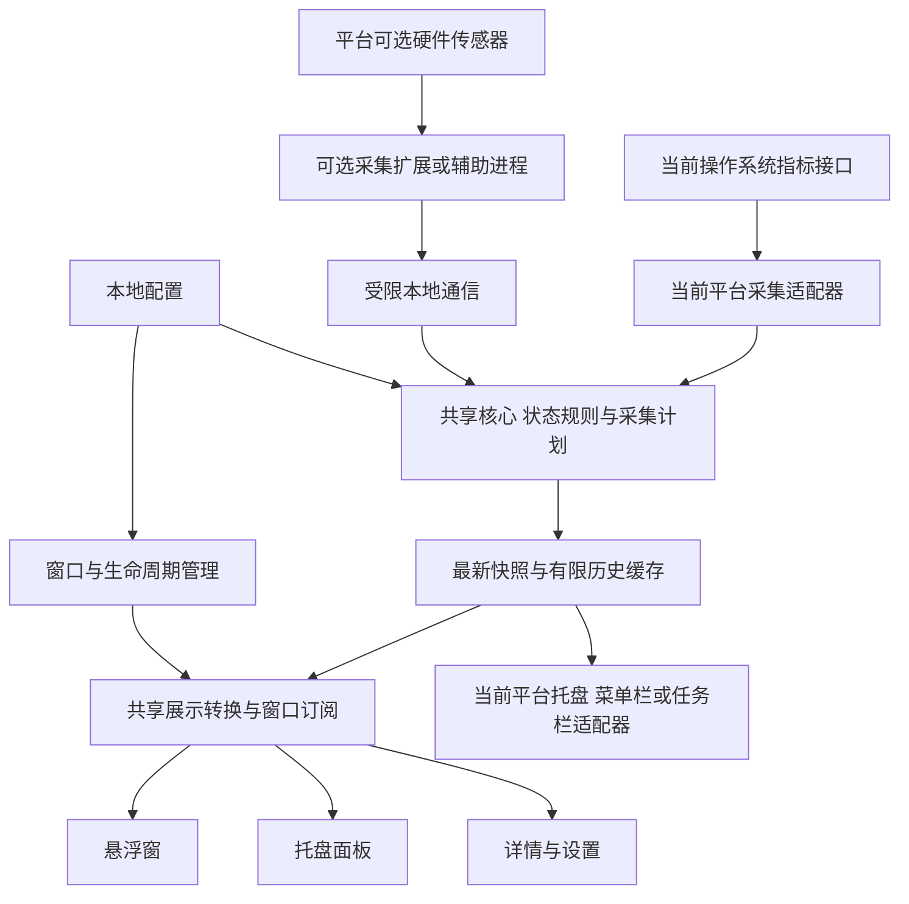

# Pinmeter 项目设计文档

[文档目录](../README.md) / 产品设计

> 版本：v0.5 · 日期：2026-09-23 · 状态：v0.1.0 主窗口、监控、托盘/任务栏及网络控制已实现；Sakani 分功能对照已开展，完整发行与长期验收待完成。

**当前工作版本：v0.1.2，最近公开预览版为 v0.1.1。** 本次增加安装版在线更新、低干扰提示和版本公告，随后推进 P0 常驻稳定性；已接入任务栏、托盘、自启、硬件信息和应用网络控制，悬浮窗仍后置。当前清单以第 4 节和各功能记录为准，功能拆分见 [开发计划](../development/README.md)。本文修订版本与应用版本独立。

**桌面入口**：[任务栏显示](../development/v0.1.0-taskbar-display/design.md) 已接入，实际环境验收见执行记录。最新关闭行为为默认询问“最小化到托盘 / 退出”，最小化使用主按钮并隐藏任务栏按钮，可记住选择并在设置中更改；设置操作后立即保存生效，与任务栏启用开关独立。详见 [desktop-runtime](../development/v0.1.0-desktop-runtime/design.md)。

**已确认界面依据：Sakani 是必须遵守的视觉与组件标准，HTML 仅为布局参考。** 具体职责与验收见第 5.4 节；现有主窗口已按 Sakani 整改，每批新增界面仍须单独核对。

## 1. 产品定位

**Pinmeter 是一款小巧、精准、干净、实用的跨平台系统性能监控工具，让用户一瞥就能了解电脑状态。**

名称采用当前仓库名 Pinmeter，含义是 **Pin + Meter：固定在屏幕角落的小仪表**。应用 Logo 已选用橙色固定针与仪表盘结合的标识，应用及安装器共用；原稿与接入见 [desktop-runtime](../development/v0.1.0-desktop-runtime/design.md)。中文名和正式标语尚未确定。

建议英文简介：

> A lightweight, cross-platform system monitor for your tray and desktop.

### 1.1 当前范围与后续方向

| 内容 | 当前定位 |
| --- | --- |
| 跨平台系统监控 | 架构隔离平台依赖，Windows 优先验证；其他平台实机验收待完成 |
| 小巧、精准、干净、实用 | 作为功能、视觉与资源预算的共同标准 |
| Tauri + React + Rust | 采用共享核心、平台适配及 MVVM 分工 |
| 主窗口、托盘与任务栏 | 已实现；完整平台兼容与长期运行验收待完成 |
| 悬浮窗、托盘面板与通用进程列表 | 后续功能，不纳入当前首版 |
| Sakani 与 HTML 布局预览 | Sakani 决定视觉与组件状态，HTML 只用于结构参考 |
| 应用流量排行与网络控制 | Windows 实现已接入，限速、恢复和发行验收范围见原功能记录 |
| IP 检测 | 采用有来源及许可告知的本地移植，服务条件和平台边界见原功能记录 |

### 1.2 设计原则

| 原则 | 对产品的具体要求 |
| --- | --- |
| 小巧 | 常驻占用可测量；小窗紧凑；隐藏界面停止绘图；按需采集昂贵指标 |
| 精准 | 明确统计口径、单位、采样时间和数据状态；不把缺失数据显示为零 |
| 干净 | 数值优先，减少装饰、重复入口和持续动画；默认不弹告警 |
| 实用 | 常用指标无需打开大窗口；允许快速隐藏、恢复、移动和查看详情 |

## 2. 使用场景与产品边界

### 2.1 主要场景

1. **日常工作**：在屏幕右上角查看 CPU、内存和网速，继续当前工作。
2. **临时查看**：点击托盘入口打开小面板，看完即收起。
3. **排查卡顿或传输缓慢**：点击某项指标查看最近趋势，后续可进一步定位进程。
4. **保持桌面整洁**：隐藏悬浮窗，保留托盘入口；再次打开时恢复位置与设置。
5. **任务栏常驻查看**：如果平台适配可行，无需点击就能看到精选指标。

### 2.2 建议首版边界

当前版本聚焦本机监控，并提供用户主动操作的应用限速/禁用及 CPU 温度驱动安装入口。远程监控、云同步、账号系统、进程终止、系统优化和长周期数据分析暂不纳入；风扇与告警保留为后续候选。

## 3. 产品形态

“任务栏集成”需要拆成可独立验收的形态，不能以托盘图标代替任务栏直接显示数值的验收。

| 形态 | 用户看到什么 | 建议职责 | 实施状态 |
| --- | --- | --- | --- |
| 主窗口 | 总览、趋势和设置页面 | 查看 CPU、内存、网络与指标口径 | v0.1.0 首版范围 |
| 系统托盘 / 菜单栏入口 | 常驻图标及菜单 | 恢复主窗口、设置、退出 | Windows 已实现；其他平台单独验证 |
| 托盘弹出面板 | 点击后出现紧凑面板 | 临时查看数值和短期趋势 | 后续 |
| 右上角悬浮窗 | 独立小窗持续显示指标 | 日常一瞥查看、拖动、锁定位置 | 后续 |
| 任务栏直接显示 | 任务栏区域内直接可见的 CPU / 网速文字 | 无需点击即可查看 | Windows 已实现；完整兼容性待验收 |

**锁定位置**表示禁止拖动；**置顶**表示覆盖普通窗口。二者使用独立设置。

Tauri 提供托盘及菜单能力，但官方文档说明 Linux 不产生所列托盘鼠标事件。因此 Linux 需要通过菜单项提供“打开面板”，不能依赖与 Windows 相同的点击事件。[Tauri 托盘文档](https://v2.tauri.app/learn/system-tray/)

## 4. 功能范围与阶段

当前 v0.1.0 以主窗口为中心，Windows 优先进行实机验收，跨平台骨架从 M0 建立。系统版本与支持范围仍按实际测试结果声明。

| 阶段 | 交付内容 | 完成条件 |
| --- | --- | --- |
| M0：建立骨架并验证主窗口与数据 | 固定模型、平台接口、代码分层和三平台构建；先完成可检查的主界面，再接入真实基础采集 | UI 演示状态明确；真实来源和错误语义可验证；性能预算与精度容差有基线 |
| M1：v0.1.0 主窗口首版 | 总览、CPU/内存/网络趋势、基础设置、五分钟历史及安装包 | 满足第 11 节中适用于主窗口和声明支持平台的验收项；关闭选择与退出清理 |
| M2：扩展桌面入口与更多平台发行 | 按后续优先级增加任务栏、悬浮窗、托盘常驻，以及 macOS/Linux 实机适配 | 各入口与声明支持的环境分别通过验收；任务栏独立验证，不把构建通过视为运行兼容 |
| M3：按反馈扩展 | 进程列表、磁盘 I/O、GPU、温度、风扇、告警等 | 按需求价值、支持范围和额外开销逐项纳入 |

### 4.1 v0.1.0 功能清单

- **主窗口**：总览、CPU、内存、网络和设置，使用与应用主题一体化的标题栏与轻量导航；具体窗口集成方案见第 5.3 节。
- **基础指标**：CPU 总使用率、物理内存已用/总量及使用率、选定网卡的上传与下载速度。
- **趋势**：最近 5 分钟的内存内历史；断档明确显示，退出后释放。
- **设置**：主题、1/2/5 秒采样间隔、自动/手动选择一个网卡，并保存已确认偏好。
- **生命周期**：单实例；最小化到托盘继续有界采集，停止界面订阅与绘图，恢复重新订阅；关闭默认询问最小化或退出，记住的选择可在设置更改。
- **异常状态**：首次采样、数据过期、权限不足、不支持、采集失败。
- **交付**：Windows 发布构建、安装/卸载、普通权限运行及已声明环境的验收记录。

任务栏直显、托盘、自启、硬件信息、CPU 温度和 [GPU 详情](../development/v0.1.0-gpu-monitoring/design.md)已纳入当前版本；悬浮窗、磁盘实时读写、通用进程页、风扇、告警和长期历史仍后置。[应用网络排行](../development/v0.1.0-app-network-ranking/design.md)默认关闭，开始后切页、托盘及界面重连持续统计；明确停止后再次开始重新累计。[应用网络控制](../development/v0.1.0-app-network-control/design.md)独立管理上下行限速、禁用和恢复，切页或停止排行不取消控制。正常退出默认解除全部限制，保留配置但不启用；用户关闭该偏好时才保留系统禁用，限速仍停止。基础场景已实测，完整传输、VPN、兼容与发行验收见各功能执行记录。

## 5. 界面与交互

v0.1.2 [在线更新](../development/v0.1.2-app-update/design.md)复用 Sakani 提示和公告弹窗：后台检查不抢焦点，用户决定下载和安装，安装前预览不推进安装后已读状态。便携测试包仅手动检查和完整包下载，实际发行和管理员安装验收按原执行记录。

IP 检测与资料作为主窗口增强，已按 v0.1.0 实现本地集成。采用源码移植及本地 Rust 执行，联网访问检测/资料来源；范围、状态和任务见 [ip-inspection](../development/v0.1.0-ip-inspection/design.md)，不表示原有发行验收已覆盖该能力。

v0.1.0 实现第 5.3 节主窗口及适用视觉规范。第 5.1、5.2、5.6 节保留为后续桌面入口设计。

### 5.1 右上角悬浮窗

建议初始尺寸约 **240 × 160 逻辑像素**，按文字缩放调整；默认距主显示器可用工作区上、右边缘各 16 逻辑像素。显示器可用工作区指扣除任务栏等系统占用后的区域。

以下仅为信息布局示意，数值是示例数据：

```text
┌─────────────────────────────┐
│ Pinmeter           锁定  ⋯  │
│ CPU       12%       ▁▂▃▂▁   │
│ 内存      46%       ▂▂▃▃▃   │
│ 下载      3.2 MB/s           │
│ 上传      128 KB/s           │
└─────────────────────────────┘
```

- 顶部空白区域拖动窗口；锁定后仍可通过菜单解锁。
- 点击指标打开对应详情页；菜单提供设置、隐藏、锁定和置顶。
- 默认开启置顶，但数据刷新和自动恢复均不抢键盘焦点。
- 隐藏小窗后可从托盘重新显示；“移回主屏”用于找回窗口。
- 保存显示器标识、逻辑位置和锚点。显示器断开、缩放或工作区变化后，将窗口限制在仍可见的工作区内。
- 全屏应用、多个桌面和屏幕边缘行为列为平台验证项；明确提供快速隐藏入口。
- 悬浮窗初版不加入鼠标穿透，确保移动、设置和恢复始终容易操作。

Tauri 的窗口接口包含置顶与逻辑/物理坐标定位能力；多显示器恢复及实际桌面行为仍需由应用实现并验证。[Tauri 窗口接口](https://v2.tauri.app/reference/javascript/api/namespacewindow/)

### 5.2 托盘面板与菜单

- 在支持的环境中，单击图标切换面板，右键打开操作菜单；Linux 通过菜单项打开面板。
- 面板靠近托盘入口显示并避开屏幕边缘；无法可靠获取位置时，在当前显示器内显示。
- 面板失去焦点或按 `Esc` 后收起；与面板关联的菜单、选择器打开期间保持可用。
- 菜单包含：打开面板、显示/隐藏悬浮窗、打开详情、设置、移回主屏、退出。
- 所有入口读取同一份最新数据，面板不会启动另一套采样任务。

### 5.3 主窗口

2026-09-22：主导航在总览后新增“硬件信息”，展示设备/系统/运行时间三项摘要与八类硬件清单。静态信息启动时异步查询一次并缓存，不周期扫描；首版显示器明确使用首选模式，详见 [hardware-info](../development/v0.1.0-hardware-info/design.md)。

建议初始尺寸约 **880 × 600 逻辑像素**，窄窗口采用纵向布局。

- **总览**：CPU 使用率/温度、GPU 使用率/温度、内存、合并上下行的网速六张卡片；六卡等宽等高，按宽度采用六列、三列、两列或单列。趋势默认显示三项使用率，可切换温度或全部五项；全部模式保留百分比和摄氏度双轴，GPU 与详情页共享选择。所有页面提供运行状态、恢复入口和使用帮助。具体布局及验收见 [main-window](../development/v0.1.0-main-window/design.md)。
- **CPU**：总占用与 CPU 温度同排均分、使用率与温度双轴趋势、逐逻辑处理器当前占用柱状图；单排固定编号顺序，空间不足横向滚动，左侧百分比刻度固定。柱高和橙色色阶均对应 0–100%，柱顶显示占用率、底部显示 CPU 编号，悬停或键盘聚焦显示实时详情。CPU 使用率/温度卡片正常时显示实际 CPU 型号，异常时保留状态。统计范围和采样间隔收进页底“关于这项指标”的信息图标浮层，默认收起；内存页同样按需展开说明。逻辑处理器不等同于物理核心，不从总占用推算单项读数；无效状态与正常 0% 分开呈现。
- **内存**：放大曲线、当前数值和统计口径。
- **网络**：选定网卡、上传/下载曲线、状态和单位说明。曲线下提供全机应用上下行排行、已归属应用占比、本次累计及进程展开；与上方选定网卡的口径明确区分，按需启用，权限不足不影响基础监控。见 [app-network-ranking](../development/v0.1.0-app-network-ranking/design.md)，部分实机与长期验收仍待完成。
- **设置**：主题、采样间隔和网卡选择；本版不提供未实现功能的占位选项。
- **IP**：侧栏位于网络之后，展示国内/公网出口、位置、运营商和信誉摘要，IPv6 紧凑呈现；AI 访问概览优先展示，网络连通性与官方服务状态位于其后，均采用本地品牌图标及状态标记，详细 IP 资料默认折叠。支持复制、分组刷新及获取日期，不显示“IP 资料 · 数据过期”横幅或性能趋势选择器；核心保留有效性和失败语义。one-ip 提供数据内容与布局参考，组件和主题遵循 Sakani；详见 [ip-inspection](../development/v0.1.0-ip-inspection/design.md)。

M1 使用轻量侧栏和一体化标题栏。平台策略为：Windows 隐藏系统标题栏，应用顶部承载固定窗口按钮及拖动区域；macOS 保留原生红绿灯并将标题栏融入应用背景；Linux 沿用非 macOS 的应用绘制控件方案并单独验证桌面环境。标题栏与内容共用主题，交互控件排除拖动；关闭默认询问、最小化到托盘继续有限采集。源码依据、Tauri 适配、顶部布局和验收维护在 [main-window](../development/v0.1.0-main-window/design.md#标题栏一体化)，当前已实现并完成 Windows 200% DPI 的主要视觉与窗口行为检查，其他环境及原生悬停贴靠面板限制见执行记录。

先用明确标注的演示数据检查布局与异常状态，正式版必须接入真实数据。磁盘和进程页面后置。

### 5.4 视觉规范

- **强制来源**：[Sakani 官方 Storybook](https://main--6a5a658b3681fcc010430db5.chromatic.com/?path=/docs/sakani-design-system--docs)。应用绘制的界面（包括一体化标题栏与窗口控件）必须遵守其中 Sakani 组件与 Blocks 的颜色、字体、间距、控件尺寸、圆角、边框、阴影、图标、图表样式和交互状态；保留的原生红绿灯与系统菜单遵循平台规范。窗口机制遵循平台能力，应用绘制区域统一使用 Sakani。
- **布局来源**：[主窗口 HTML 布局预览](../development/v0.1.0-main-window/assets/main-window-preview.html) 只定义页面组成、信息层级和区域安排。其中自定义 CSS、配色、字号、图标与 SVG 外观不作为标准；组件规格与布局示意冲突时按 Sakani 规格调整容器布局。
- **控件与主题**：已有通用控件复用 Sakani，统一使用官方设计变量和深浅主题。业务曲线或原生绘制可定制实现，但必须沿用 Sakani 的视觉规则；不得以轻量或紧凑为由另建配色与控件样式体系。
- **字体与密度**：遵循 Sakani 的 Geist 字体及排版规格，中文使用合适的字体回退；监控数字使用等宽数字宽度和稳定数值列。紧凑界面从官方尺寸与间距规格组合，文字放大后允许重排与滚动。
- **状态**：默认跟随系统主题，提供浅色和深色；按对应组件核对默认、悬停、焦点、选中、禁用、加载和错误状态。CPU、内存和流量变化本身不触发警告色或弹窗。
- 状态同时使用文字或图标，不能只靠颜色区分；交互控件提供键盘焦点与名称。
- 关闭持续插值动画，尊重减少动态效果的系统偏好；读屏不逐秒播报所有数值。
- CPU/GPU 使用率和物理内存图固定 0–100% 纵轴；CPU/GPU 核心温度使用独立 °C 右轴，范围默认 0–100°C，超界按 20°C 扩展；网络图、GPU 内存量与频率按数值自动缩放，详情必须显示单位与刻度。
- **可复核验收**：功能设计记录采用的 Sakani 组件/示例链接和依赖版本或源码提交，截图放原功能 `assets/`，对照检查深浅主题及适用控件状态，结果写入原 `execution.md`。功能可用、无溢出和构建通过均不能替代视觉一致性验收；新增界面和未覆盖的原生环境继续独立验收。

### 5.5 建议默认设置

| 设置 | 默认值 |
| --- | --- |
| 主题 | 跟随系统 |
| 基础采样间隔 | 1 秒，可选 1 / 2 / 5 秒 |
| 内存历史 | 最近 5 分钟，不跨退出保存 |
| 主窗口 | 首次显示，后续恢复可见范围内的尺寸与位置 |
| 关闭 / 最小化 | 默认询问最小化或退出，可记住；最小化继续采集，暂停界面更新 |
| 网卡 | 自动选择当前主要联网接口，并显示接口名、允许手动覆盖 |
| 开机自启 | 默认关闭；用户开启后登录 Windows 自动打开，取消或恢复默认移除启动任务 |
| 托盘、悬浮窗与任务栏 | 常驻及任务栏行为按原功能设计，悬浮窗后置 |
| 退出解除网络限制 | 默认开启；保留规则但停用，下次启动由用户手动启用 |
| 告警 | 首版不提供 |

### 5.6 任务栏读数的视觉方向

用户认为 TrafficMonitor 的任务栏显示样式需要改善，并认可参考其技术实现。Pinmeter 的目标是**清晰、安静、与系统任务栏协调的原生小仪表**。

2026-09-17 用户选择双行紧凑为默认，单行作为可选布局；完整行为见 [任务栏功能设计](../development/v0.1.0-taskbar-display/design.md)。以下仅示意结构和示例数据，不代表最终字体、间距或实机效果：

```text
↓ 3.2 MB/s     CPU  2% (57°C)     内存 44%
↑ 128 KB/s     GPU 18% (49°C)
```

- **信息克制**：默认下载/上传、CPU/GPU 使用率与括号温度、内存；CPU/GPU/内存可分别取消；空间不足先减少可选组，再降级为明确不可用。点击打开已有指标详情，独立弹出面板后置。
- **文字有层次**：数值为主要信息，标签和单位适当弱化；应用绘制的读数遵循第 5.4 节的 Sakani 字体与等宽数字规范，保持足够对比度。
- **读数不跳动**：数值列与单位留出稳定宽度，统一基线与垂直居中；数值更新不改变整个窗口宽度。设备、主题、缩放或用户配置变化时才重新布局。
- **背景协调**：按 2026-09-17 用户要求，任务栏读数使用全透明背景，常态及悬停均不绘制实色底板，像系统日期一样由任务栏提供背景。文字、图标和焦点沿用 Sakani 对应主题语义变量；独立 Tooltip 保持其组件表面。透明合成、文字边缘与输入范围按 taskbar-display 设计验证。
- **反馈轻量**：悬停反馈与指标提示沿用 Sakani 对应状态；点击进入对应详情，右键提供设置菜单。数值变化不闪烁、不播放持续动画。
- **空间不足有规则**：仅在布局或配置变化时减少展示组；首期保留完整上下行，仍放不下则隐藏直显并说明原因，保留托盘恢复；不覆盖应用按钮、系统托盘或时钟。
- **曲线按需**：默认以数值为主；有足够空间时才评估极简趋势线，不把详情图表缩小后塞进任务栏。
- **可访问性**：键盘与托盘菜单均能打开同一面板；原生读数提供可访问名称、单位和有效状态。

尺寸按逻辑像素计算，再按当前显示器缩放对齐实际像素；具体字号和宽度由 100% / 150% / 200% 实机截图确定，不预先承诺一个尺寸适配所有任务栏。

## 6. 指标口径与数据状态

### 6.1 基础指标

| 指标 | 口径与单位 | 刷新建议 |
| --- | --- | --- |
| CPU 总使用率 | 两次有效采样间全部逻辑处理器的忙碌时间占比，归一化至整机 0–100%；适配器记录系统来源 | 跟随基础间隔 |
| 物理内存 | 展示系统来源给出的已用量、总量及其比值；明确缓存/可回收内存是否计入，详情保留平台说明 | 跟随基础间隔 |
| 网络上传/下载 | 选定接口累计字节差除以真实经过秒数，内部为 B/s | 跟随基础间隔 |
| 磁盘卷容量（后续） | 总容量、可用容量、总量减可用量；区分文件系统保留空间等平台语义 | 相关详情可见时每 30 秒或设备变化时 |

内存默认使用二进制单位（MiB / GiB）；网络默认使用十进制单位（KB/s / MB/s）。百分比小窗显示整数，详情最多一位小数；实际采样保留原始精度。小窗和详情统一格式，单位不能省略到产生歧义。

### 6.2 精准性规则

1. **使用真实时间差**：速率计算使用单调时钟，不假设定时器总能每秒准时执行；日期时间只用于展示。
2. **CPU 需要预热**：得到足够的前后采样之前显示“采样中”，不把首次无效读数显示成真实零负载。
3. **网卡范围明确**：自动模式选定一个接口，不能简单相加物理网卡、VPN 和虚拟接口；手动选择后不静默切换。多网卡合计留待后续明确规则。
4. **计数器变化重建基线**：网络断开、接口更换、累计计数回退或休眠恢复时舍弃跨边界速率，在图中保留空缺，避免尖峰。
5. **休眠不补伪造历史**：恢复后重新采样；断档不以零值或插值填充。
6. **语义统一、来源透明**：适配器提供数据来源与口径说明。系统自带工具采用不同口径时，先解释差异，再判断误差。

### 6.3 数据状态

| 状态 | 数值展示 | 图表与交互 |
| --- | --- | --- |
| 正常 | 当前值，包括真实的 `0` | 正常绘制 |
| 采样中 | `—`，说明正在采样 | 取得有效基线后开始绘制 |
| 不支持 | `—`，标注“不支持” | 不生成零值曲线 |
| 权限不足 | `—`，说明当前权限无法读取 | 其他指标继续工作 |
| 采集失败 | `—`，提供简短原因 | 该项重试，其他采集不受阻塞 |
| 数据过期 | 可保留上次读数，但弱化并显示更新时间 | 中断曲线，不能伪装为实时值 |

过期判定建议为超过该指标期望间隔的 3 倍仍无有效更新；不同刷新周期的指标分别计算。

## 7. 技术架构建议

### 7.1 技术栈与集成约束

| 层次 | 方案 | 职责与验证条件 |
| --- | --- | --- |
| 桌面外壳 | Tauri 2 | 承担窗口、托盘、生命周期和本机通信；实测 WebView 资源开销 |
| 界面 | React + TypeScript | 复用紧凑指标组件、详情和设置；按窗口加载必要内容 |
| 设计基础 | Sakani，必须遵守 | 复用官方设计变量、主题和已有基础控件；按需导入并验证体积、缩放和键盘操作，视觉标准不作为待选项 |
| 小窗数值与简图 | 按 Sakani 规范组合 React 控件与定制 SVG | 业务布局可控、点数有上限；自定义绘制沿用官方字体、颜色、间距及图表样式 |
| Windows 任务栏读数 | 原生窗口 + Direct2D / DirectWrite 候选 | 独立重做排版与绘制；与 React 共享颜色、字号和间距配置；只在纳入任务栏功能时实现 |
| Windows 基础采集 | Rust + `windows-rs`，封装 PDH、内存与网卡 API | CPU / 内存 / 网络逐项返回有效性和来源，控制错误处理与接口身份 |
| 跨平台与按需查询 | `sysinfo` | 其他平台基础指标；Windows 按需进程、磁盘容量；锁定版本并检查错误可见性 |
| Windows GPU | 普通权限 LHM 独立采集进程 | D3D 最忙引擎、专用/共享内存；厂商核心温度与频率按能力展示，多卡分别采样 |
| Windows 其他扩展指标 | 可选 PDH 采集器 | 磁盘 I/O 等分别验证后增加 |
| 硬件传感器 | 可选 C# 进程 + LibreHardwareMonitorLib | 需要温度 / 风扇等能力时再启用；独立处理 .NET、驱动、权限和兼容性 |
| 配置 | 本地版本化配置文件 | 保存偏好和窗口状态；历史数据先只留内存 |

Sakani 官方提供设计变量、React 控件和图表组件；页面模块可按业务组合调整布局，视觉依据保持为第 5.4 节的官方标准。现有应用已固定接入官方组件及变量，业务封装不能改用 HTML 自绘样式；每批界面的对照结果与未完成项见原功能执行记录。[Sakani 官方仓库](https://github.com/samzydd/Sakani-design-system)

`sysinfo` 支持跨平台并建议复用实例、按需刷新，仍适合复用；但本文不再假设它能完整提供 Windows 的逐项错误状态。已核对稳定版与开发分支差异、原生 API 选择及传感器依赖，证据见 [采集方案调研](../research/windows-monitoring.md)。

具体依赖版本在原型建立时锁定并记录；已完成的组合运行、体积及性能记录见 desktop-runtime，新增能力需要重新测量。技术库是适配器的实现工具，代码分层以 [架构文档](../architecture/overview.md) 为准；Windows、macOS、Linux 适配器平级，`sysinfo` 不代表一个单独的平台层。

### 7.2 数据流



- **统一采样服务**：全应用统一调度，每项指标只有一个生产数据源；多个窗口不会增加采样次数。不同采集器独立执行，慢传感器不阻塞 CPU / 网络刷新。
- **平台采集适配器**：输出统一的数据类型与能力状态，处理平台 API 差异。
- **缓存**：按时间和最大点数双重限制；1 秒采样、5 分钟历史约 300 点/序列。
- **界面通信**：首次打开建立订阅并获取快照与有限历史，之后推送增量；隐藏后注销订阅，恢复时重新订阅。快照合并时根据后端补齐标记和历史游标取回遗漏样本，已淘汰的区间明确标为缺失；批次序号与历史游标分开，详见架构文档。
- **原生系统集成**：托盘菜单与未来任务栏显示可在没有可见 WebView 时工作。
- **设置变更**：经 Rust 校验后生效，并通知其他窗口；前端不直接操作系统采集接口。

该图表示运行时数据流。代码依赖方向、View / ViewModel / 用例的职责，以及原生入口如何调用同一套用例，分别在 [架构文档](../architecture/overview.md) 中定义。

### 7.3 建议数据契约

| 数据 | 关键字段 / 约束 |
| --- | --- |
| 快照与推送 | 协议版本、会话/订阅标识、订阅批次序号、历史游标及覆盖边界、展示时间、实际采样间隔 |
| 单项指标 | 值或空值、单位、状态、有效采样时间、接收时间、来源及版本、口径标识、失败原因码；无法确认刷新成功时不推进有效时间 |
| 网络指标 | 稳定接口标识、显示名称、收发速率、基线代次；接口更换不得接续旧曲线 |
| 能力清单 | 当前平台可采集的指标、支持的系统入口、缺失原因 |
| 历史样本 | 时间、值或空值、状态；保留断档；限制请求的时间范围和返回点数 |
| 用户设置 | 配置版本、采样周期、显示指标、网卡、主题、窗口位置与显隐偏好 |

Rust 保留累计计数的整数精度，先算差值再输出速率；若需将可能超过 JavaScript 安全整数范围的累计值传给前端，使用十进制字符串。历史样本按会话、历史游标及指标/设备标识去重，避免历史回填与实时更新重叠；订阅批次序号仅用于传递顺序与确认。

### 7.4 Windows 采集边界

- **首版核心**：CPU 用 PDH 忙碌时间口径，内存用 `GlobalMemoryStatusEx`，网卡用 `GetIfTable2`。保留系统返回状态，不以零值表示调用失败。具体 API 与证据见 [调研文档](../research/windows-monitoring.md)。
- **单一来源**：同一指标不同时运行原生与 `sysinfo` 两套生产采集；对照采集只用于测试。来源或口径变更需要清空速率基线并中断相应历史曲线。
- **高级能力按需增加**：GPU 利用率与温度分属不同采集需求；任务栏适配也不承担任何指标采集职责。
- **启动统一授权**：Windows 手动启动请求一次系统授权，主程序及采集器共用本次权限；CPU 温度默认采集，无单独授权按钮，GPU 和应用网络不再分别授权。取消授权结束本次启动。2026-09-18 增加默认关闭的开机自启：用户在已授权应用中开启后，创建仅当前用户登录触发的最高权限交互式计划任务，不保存密码、不安装服务；取消勾选移除。详见 [设置设计](../development/v0.1.0-preferences/design.md)。缺少传感器驱动时明确显示不可用。
- **独立进程的边界**：可以隔离用户态阻塞和崩溃，不能消除驱动自身故障的影响；需要单独验证驱动和硬件兼容性。
- **通信与缓存**：硬件进程只提供读取接口；使用有访问控制的本地通信。每项结果保留真实有效时间，推送队列有上限，界面来不及消费时合并为最新状态。

### 7.5 代码组织基线

| 部分 | 责任 | 依赖边界 |
| --- | --- | --- |
| Domain | 指标身份、单位、语义、有效状态和纯计算 | 不依赖系统、桌面框架或第三方采集库 |
| Application | 采样计划、状态/历史、来源选择、配置及桌面用例 | 依赖 Domain 和项目定义的 Ports |
| 平台适配器 | 系统采集、能力探测、桌面入口及本地存储 | 实现 Ports，将平台结果转换成项目类型 |
| Controller | Tauri 命令及原生点击回调 | 薄入口，检查调用者并委托同一套用例 |
| ViewModel | 可显示状态、表单草稿、请求状态和操作 | 通过统一客户端访问后端，不直接调用系统 API |
| View | React 组件或原生读数视图 | 消费投影并发出用户操作，不采样、不重算指标 |

UI、跨平台适配与业务逻辑分别放在 `src/frontend/`、`src/backend/platform/`、`src/backend/core/`；`src/backend/host/` 负责 Tauri 装配与通信。Rust 工作区包含核心、平台适配、宿主三个 crate，以普通模块、少量接口和 feature hooks 实现。详细依赖与目录见 [架构文档](../architecture/overview.md)。

## 8. 采样、生命周期与资源控制

| 应用状态 | 采集行为 | 界面行为 |
| --- | --- | --- |
| 主窗口可见 | 基础指标按配置周期采集，切页不重复采样 | 仅更新当前可见数值与有界曲线 |
| 主窗口最小化 | 保留基础采集及 5 分钟历史 | 注销界面订阅，停止推送和绘图；恢复时重新订阅并补齐 |
| 系统休眠 / 恢复 | 恢复时重建速率基线 | 显示采样中，历史留断档 |
| 关闭主窗口或明确退出 | 停止采样，保存已确认配置，释放窗口和系统资源 | 不留后台进程 |

其他规则：

- 采集轮次不重叠；超时或慢接口使用跳过、隔离与退避，避免任务越积越多。
- 不每秒全量枚举进程或重建硬件列表；进程信息仅在后续进程页可见时采集。
- 关闭窗口默认询问最小化或退出；可记住本次选择，也可在设置中重设。明确退出仍需完成网络限制清理。
- 再次启动激活现有实例的主窗口；常规数据刷新及休眠恢复不抢焦点。
- 配置写入合并处理并采用原子替换；遇到损坏配置使用默认值，同时保留可诊断信息。
- 常规采样不写日志；日志限量轮换，避免常驻工具持续占用磁盘。

## 9. 跨平台与任务栏适配

### 9.1 支持策略

| 平台 | 建议首选入口 | 必须验证的差异 |
| --- | --- | --- |
| Windows | v0.1.0 主窗口；后续再增加托盘、悬浮窗与任务栏直显 | 首版验证系统版本、缩放、多屏和恢复；任务栏阶段再验证自动隐藏、Explorer 重启 |
| macOS | 菜单栏入口 + 悬浮窗 | 菜单栏交互、全屏与桌面空间、窗口焦点；文字读数单独评估 |
| Linux | 桌面环境支持的托盘菜单 + 可用窗口入口 | 桌面环境、托盘支持、X11 / Wayland 下的定位与置顶实际行为 |

跨平台目标是共享采集契约与主要使用体验。正式支持清单需列出实际验证的系统版本、CPU 架构和 Linux 桌面环境；尚未测试的平台标为“待验证”。

跨平台是从 M0 起的代码约束。平台专属依赖通过条件编译隔离，运行时再探测托盘、定位、置顶和摘要显示等独立能力；共享界面按能力展示。Windows 任务栏、macOS 菜单栏和 Linux 桌面入口消费同一摘要，但不要求呈现形态相同。[平台边界与能力模型](../architecture/overview.md)

### 9.2 Windows 任务栏直接显示验证

原型目标示例：在任务栏区域持续显示 `CPU 12%  ↓ 3.2 MB/s  ↑ 128 KB/s`，并能打开详情或菜单。

微软文档列出的任务栏扩展包含进度条、叠加图标和缩略图工具栏等。仅依据这些接口，尚不能确认满足连续多项文字读数的需求，需独立验证实现路径。[Windows Taskbar Extensions](https://learn.microsoft.com/en-us/windows/win32/shell/taskbar-extensions)

任务栏开发阶段需产出可运行样例，或有实验依据的不可行/未达可靠性要求报告。结果用于决定后续版本的任务栏支持范围；报告至少覆盖以下内容，对未能继续的项目说明阻碍：

1. 已尝试的系统集成方式、实验结果及依赖，明确是真正嵌入还是独立贴边窗口；可运行时附样例。
2. 支持的 Windows 版本与缩放组合；系统更新后的兼容风险。
3. 与任务栏按钮、系统托盘、自动隐藏和多显示器的共存结果。
4. Explorer 重启后恢复能力，以及任务栏适配失效时主程序的表现。
5. 额外 CPU / 内存开销、点击区域、文字截断和退出清理结果。

若只能实现靠近任务栏的独立浮条，应明确命名为“贴边浮条”，不能当作真正嵌入任务栏的证明。该研究不阻塞 v0.1.0 主窗口版本。

### 9.3 任务栏系统适配与视觉绘制分离

TrafficMonitor V1.86 的任务栏代码已包含 GDI、Direct2D、Direct2D + DirectComposition 路径，也独立配置字体、颜色、排列和间距。它的现有样式不是任务栏嵌入技术的固定结果；换渲染 API 本身也不等于完成视觉优化。[TaskBarDlg.cpp](https://github.com/zhongyang219/TrafficMonitor/blob/V1.86/TrafficMonitor/TaskBarDlg.cpp)

| 部分 | Pinmeter 的职责 |
| --- | --- |
| 系统适配 | 参考任务栏定位、父窗口设置、尺寸变化和 Windows 版本适配经验；验证自动隐藏、Explorer 重启和多屏恢复 |
| 布局与绘制 | 根据可用区域、主题、缩放及用户选择生成紧凑布局；按第 5.4 节 Sakani 规范绘制文字、图标、悬停态和可选趋势线 |
| 数据与交互 | 读取 Rust 的统一快照；将点击转换成打开 React 面板的操作；不额外创建采集循环 |

建议优先验证 Direct2D + DirectWrite 绘制，透明背景需要时再加入 DirectComposition。原生绘制与 React 共用语义颜色和尺寸配置，以保持任务栏、悬浮窗和详情的一致性；任务栏条不直接承载 React WebView。Direct2D 提供二维图形与文字渲染，并支持与 DirectWrite 配合。[微软 Direct2D 文档](https://learn.microsoft.com/en-us/windows/win32/direct2d/direct2d-overview)

任务栏原型阶段应将静态视觉样例和嵌入分别验证，再合并检查透明文字清晰度、点击区域和缩放。跨进程 `SetParent` 存在 DPI 感知模式限制，须验证是否影响 Tauri 主进程；如需要进程级隔离，再评估独立轻量任务栏宿主及其开销。[SetParent 文档](https://learn.microsoft.com/en-us/windows/win32/api/winuser/nf-winuser-setparent)

## 10. 本地数据与权限

- CPU、内存、网速等监控数据只在本机使用，无账号、云端上传或遥测；最近历史在退出后释放。
- IP 功能按需联网：仅进入 IP 页或主动刷新且需要更新时查询，检测服务会看到请求出口，资料服务接收被查询的公网 IP；页面明确第三方来源。启动在其他页面及最小化不主动检测，不发送硬件/进程数据，不保存 IP 查询历史到磁盘，不将完整 IP 或原始响应写入诊断日志。具体缓存及生命周期见 [ip-inspection](../development/v0.1.0-ip-inspection/design.md)，具体已验证范围见执行进度。
- 基础能力以普通用户权限运行为目标；单项权限不足不阻断全局监控。
- 前端只调用明确声明的采集读取、设置和窗口命令；Rust 校验输入及访问范围。
- 发布界面使用本地打包资源；配置不保存完整进程命令行或不必要的设备身份信息。
- 对外诊断记录优先保留版本、耗时与错误码；未来若加入导出，由用户显式触发。

Tauri 将 WebView 与 Rust 核心区分为不同信任边界，通信接口需要明确访问范围；权限配置也不能代替命令自身的输入校验。[Tauri 安全模型](https://v2.tauri.app/security/)

## 11. 质量目标与验收

### 11.1 轻量性评估

**以下数值是用于原型评估的暂定预算，不是实测结果或用户已确认的承诺。** M0 应先固定参考机器、系统版本与测量工具；若未达标，记录原因并评估采集频率、WebView 生命周期和界面依赖，不能直接宣称轻量目标已达成。

| 状态 | 平均 CPU 预算 | 内存预算 |
| --- | --- | --- |
| v0.1.0 主窗口可见，1 秒刷新 | ≤ 1.0% 整机 CPU | ≤ 180 MiB |
| v0.1.0 主窗口最小化 | ≤ 0.5% 整机 CPU | ≤ 120 MiB |
| 仅托盘，基础采集继续 | ≤ 0.5% 整机 CPU | ≤ 120 MiB |
| 单个悬浮窗可见，1 秒刷新 | ≤ 1.0% 整机 CPU | ≤ 180 MiB |
| 详情与悬浮窗同时可见 | ≤ 2.0% 整机 CPU | ≤ 250 MiB |

测量方式：使用发布构建，关闭开发工具，预热 2 分钟后每种状态测量 10 分钟；包含应用及其相关 WebView 子进程，记录聚合口径并避免共享内存重复计数。报告平均 CPU、采样分位数、峰值与稳定内存；跨系统单独报告，不直接混用不同内存口径。另记录安装包体积及额外运行时前提。

未来启用硬件传感器进程时，将该进程及相关开销纳入统计，并分别报告“基础监控”和“开启传感器”两种配置；当前预算尚未验证任何一种实现。

后续托盘/悬浮窗场景的预算不属于 v0.1.0 验收。持续运行至少 8 小时，确认历史点数、内存、句柄和线程不随运行时长持续增长。主窗口恢复目标为 300 毫秒内出现已有数据；冷启动目标为 3 秒内出现可操作入口，CPU 等读数允许先进入预热状态。上述时间同样为待基线测量固定的目标。

### 11.2 精准性验收

- **确定性计算**：已知计数差与时间差必须得到正确速率；覆盖首次采样、计数回退、间隔变化与休眠断档。
- **真实来源比对**：在相同网卡、单位、CPU 归一化与内存口径下，对照平台原始计数或可靠参考工具。
- **窗口对齐**：分别测试空闲、持续 CPU 负载、内存分配和稳定网络传输；记录至少 60 秒同时间窗数据，不能用不同时刻的截图判定误差。
- **误差标准**：M0 首轮真实采集对照记录各适配器的合理偏差与原因，再固化数值阈值；未设定阈值或存在无法解释的系统性偏差时，M1 精准性验收不通过。
- **状态正确**：不支持、失败、过期与真实零值可区分；切换接口后不拼接旧流量曲线。
- **Windows 错误注入**：覆盖不存在的 PDH 实例、无效计数器状态、网卡移除以及未来传感器进程超时/驱动缺失；读取失败不能生成假的 0% 或 100%，也不能仅因轮询完成就将旧数据标成新数据。

### 11.3 功能与兼容性验收

| 场景 | 通过条件 |
| --- | --- |
| 启动与退出 | 单实例；Windows 启动统一授权；关闭按偏好询问/收起/退出，明确退出完成清理且无残留 |
| 最小化与恢复 | 最小化停止界面更新但继续有限采集；恢复时重新订阅，补齐历史并继续更新 |
| 多窗口一致性 | 相同样本序号的数据一致；窗口增加不会重复采样 |
| 主窗口交互 | 可调整大小和最小化，页面切换与恢复可用；常规刷新不抢焦点 |
| Sakani 视觉一致性 | 按第 5.4 节对照五页深浅主题与适用控件状态，字体、颜色、间距、尺寸、图标及图表符合标准；截图和来源可复核，HTML 仅用于布局 |
| 多屏与缩放 | 验证 100% / 150% / 200% 及混合缩放；断开显示器后窗口仍可操作 |
| 休眠与设备变化 | 无伪造连续曲线或速率尖峰；网络状态恢复合理 |
| 长时运行 | 缓存有上限；关闭界面后停止绘图；资源无持续增长趋势 |
| 可读性与无障碍 | 深浅主题可读；数字变化不明显跳动；可用键盘完成主要操作 |
| 任务栏直接显示（纳入发行范围时） | 按第 9.2 节独立验收；托盘或贴边浮条不能替代 |
| 平台发布 | 本阶段声明支持的环境均完成采集、入口、窗口恢复及安装/卸载验证；M2 扩展平台时同样适用 |
| 跨平台代码边界 | M0 即运行三平台构建与核心测试；核心无平台 SDK 依赖，平台能力缺失有明确状态 |
| 界面与状态边界 | View 不直接采集或 invoke；多个窗口和原生入口使用同一配置版本与有效样本；订阅释放和补齐规则正确 |

## 12. 开始实现前需要收敛的事项

以下保留已确认决策与待收敛事项；建议和待验证项不能覆盖第 5.4 节已确定的 Sakani 视觉标准。

| 事项 | 当前结论 | 验证或确定时点 |
| --- | --- | --- |
| 首发平台及版本 | Windows 优先；参考环境 Windows 11 专业版 10.0.26200、64 位，已完成部分应用实测 | 实际支持范围与剩余验收见各功能记录 |
| 代码组织与跨平台边界 | 按架构文档执行模块化单体、共享核心/平台适配和 MVVM 式界面分层 | 编码前作为基线；后续变更同步记录职责和依赖影响 |
| 首版界面范围 | 主窗口优先；任务栏和托盘已接入，浮窗后置 | 当前实现见各功能记录 |
| Sakani 标准与集成 | 官方主题/控件已接入，HTML 仅供布局 | 每批新增界面单独对照并记录验收 |
| 主窗口信息密度 | 总览六张指标卡，资源趋势按使用率、温度或全部分组 | 已实现，完整原生验收见 main-window |
| 性能预算和精度容差 | 以第 11 节为起点，结合参考机器和平台来源固化 | M0 结束时 |
| 高级指标及进程列表 | 后续按反馈增加 | M1 使用反馈后 |
| 分发方式与许可证 | 另行确定项目许可证、安装包和签名方案 | 首次对外发布前 |

**设计基线：先完成跨平台骨架、主窗口与真实基础监控，以清晰口径和可测量的自身开销交付 v0.1.0，再扩展常驻入口与高级指标。**
