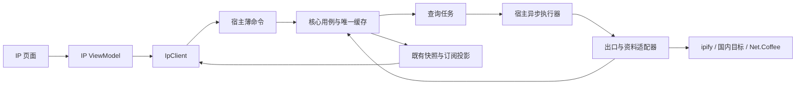

# ip-inspection

> 当前工作版本：v0.1.0
>
> 2026-09-17 用户选择源码提取与移植集成，要求封装清楚并先完成文档计划。本地实现按 v0.1.0 组织；发布及跨平台验收状态见执行进度。

## 目标与范围

- 在主窗口新增 IP 栏，检测本次请求的公网出口并显示相关资料。提取 one-ip 的出口检测、资料查询及字段转换实现，移植到本项目 Rust 适配层；不把整个仓库作为 npm/Cargo 依赖，不运行其 React 应用或 Cloudflare Worker。
- 数据内容采用 one-ip 所用来源；联网检测访问 ipify、国内检测目标与 Net.Coffee，不依赖作者部署的 `ip.huzhihui.com` 服务，也不自建服务器。源码移植不等于离线数据库，第三方服务仍有可用性、额度和字段变化约束。
- 本批实现：IPv4、IPv6、国内目标出口，归属地、运营商、ASN、信誉、网络与风险属性、多源位置对比，复制、刷新及独立异常状态。关联域名和上游返回的位置/ASN/企业历史仅在有数据时展开，不额外主动探测。
- 本次增加网络连通性、AI 访问概览及官方服务状态，并按用户截图重排概览、使用本地品牌图标。地图、IP 画像图、任意 IP 搜索、全网站分流、全球 Ping、DNS/WHOIS 独立工具及浏览器指纹后置。
- 按[产品设计](../../design/product-design.md)和[技术架构](../../architecture/overview.md)执行，Windows 先实机验证，HTTP 与字段适配共享；macOS/Linux 的代理差异隔离，不以编译通过代替出口验证。

## 方案

### 源码来源与维护

以 one-ip 提交 `5686f3f1c21eec9e276e6338c67c599cc299629c` 为首次移植基线；2026-09-17 已核对以下文件。实现时记录具体提取的函数与本地差异，更新由人工检查提交差异并运行契约测试，不自动同步远端代码。

| 上游来源 | 移植内容与本地调整 |
| --- | --- |
| [home/api.ts](https://github.com/zhihui-hu/one-ip/blob/5686f3f1c21eec9e276e6338c67c599cc299629c/src/views/home/api.ts) | 双栈 ipify 查询、国内目标 HEAD 响应头检测；移除 React/浏览器依赖，以 Rust 严格校验地址与协议族 |
| [ip/api.ts](https://github.com/zhihui-hu/one-ip/blob/5686f3f1c21eec9e276e6338c67c599cc299629c/src/views/ip/api.ts)、[coffee.ts](https://github.com/zhihui-hu/one-ip/blob/5686f3f1c21eec9e276e6338c67c599cc299629c/src/views/ip/coffee.ts) | Net.Coffee 完整资料查询、返回地址匹配与字段映射；原始 JSON 和命名只留在适配层 |
| [worker/ip-health.js](https://github.com/zhihui-hu/one-ip/blob/5686f3f1c21eec9e276e6338c67c599cc299629c/public/worker/ip-health.js)、[http.js](https://github.com/zhihui-hu/one-ip/blob/5686f3f1c21eec9e276e6338c67c599cc299629c/public/worker/http.js) | 有效分数、三态标记、超时和响应大小边界；不移植 Worker 路由及 `CF-Connecting-IP` 依赖 |
| [ip/details.tsx](https://github.com/zhihui-hu/one-ip/blob/5686f3f1c21eec9e276e6338c67c599cc299629c/src/views/ip/details.tsx) | 仅参考信息分组和布局，View 由 Sakani 组件重新组合 |

上游为 [AGPL-3.0](https://github.com/zhihui-hu/one-ip/blob/5686f3f1c21eec9e276e6338c67c599cc299629c/LICENSE)。移植代码随所属模块保留许可证、版权、来源提交和修改说明；落点为 `platform/src/ip/third-party/one-ip.LICENSE` 与 `NOTICE`，其他派生文件带来源注释。派生文件保留 AGPL-3.0，完整许可证与 NOTICE 随前端本地资源打包，可在页面展开阅读。2026-09-28 用户确定整体项目采用 AGPL-3.0-only，根 LICENSE 与工程清单统一声明，第三方条款保持不变；同步更新页面消费的 NOTICE 文本，不改变布局或交互。完整对应源码交付及其他发行条件仍需核对，实际进度见 [development-workflow](../v0.1.0-development-workflow/execution.md)。

### 封装与工程归属

保持三个 Rust crate，不增加通用插件、服务注册或 HTTP 框架。两个核心能力端口分别承担出口检测与资料查询，时钟复用既有契约；HTTP 使用 reqwest 0.13.5（rustls、socks），tokio 1.53.1 提供超时，httpdate 1.0.3 解析 Retry-After；具体 HTTP 类型仅留在 platform。

| 模块 | 负责 | 对外边界 |
| --- | --- | --- |
| `core/src/ip/` | 项目模型、查询计划、接纳结果、有效性、退避与有界缓存 | `IpInspection` 用例；`ExitDetector`、`IpProfileProvider` 能力端口；项目任务与结果类型 |
| `platform/src/ip/` | `exit` 出口探测、`coffee` 私有响应 DTO/映射、`http` 有界请求与取消 | 实现上述端口，只输出 core 类型；端点和上游字段不穿透 |
| `platform/src/ip/proxy.rs` | 各系统代理解析和能力报告 | 共享请求策略；系统 API 以条件编译隔离，普通模块按实际需要建立 |
| `host/src/ip/` | 装配、独立异步任务、命令授权、DTO 投影 | 复用既有 Runtime、命令和订阅，不持有第二套缓存或业务规则 |
| `frontend/src/features/ip/` | `IpView`、`useIpViewModel` 与业务展示组件 | 只依赖项目 DTO、`IpClient` 和 Sakani |
| `frontend/src/shared/client/` | 窄 `IpClient` 与既有监控客户端的组合适配 | 提供只读快照/订阅、页面活跃登记和刷新操作；Tauri 仅在此封装 |

表中前端路径相对于 `src/`，后端路径相对于 `src/backend/`。主应用只接入导航、装配与页面组件；现有 `runtime.rs`、`commands.rs`、`presenters.rs` 只接入必要调用，不堆积解析与重试逻辑。测试跟随所属模块；共享协议由现有 `export-contracts` 路径生成到前端受控目录。真实服务冒烟入口为 platform 的 `ip-probe` example，默认测试使用固定样本与本地 HTTP 替身。

图为运行流程；代码依赖仍为 `host → platform/core`、`platform → core`。HTTP 等待期间不持有基础监控状态锁，不在采样线程或 UI 线程请求网络；完成后经现有串行状态入口接纳。

### 数据与请求契约

- `ExitAddress` 与 `Query`：检测目标 ID、预期地址族、规范化公网 IP、来源、实际请求路由说明、有效时间、状态及失败码。IPv4、IPv6、国内目标独立，不能用一个失败推断其他能力缺失。
- `IpProfile`：规范化 IP、来源/适配版本、查询有效时间，以及可空的位置、运营商/ASN、CIDR/地址范围、反向 DNS、注册国家、RPKI、信誉分、网络类型和风险标记；多源位置与可选关联/历史是有界列表。原始供应商 JSON 不交给 View，也不整包写入日志。
- `IpInspection`：状态修订号、查询代次、各出口和资料状态、查询进度及允许重试时间；会话沿用监控外层协议，已识别网络/路由变化使查询代次失效。IP 信誉 `good/moderate/poor/unknown` 与请求 `idle/loading/ready/failed/stale/unsupported` 分开；`ready` 不表示信誉良好。
- 风险布尔保持 `true/false/unknown`；信誉分只接受有限的 0–100 数值，75/45 阈值沿用上游口径；无效分数显示未知，不计算自有风险分。位置只代表数据源估计，关联记录只代表上游关联，不推断所有权或真实物理位置。
- 规范化后比较请求与返回 IP；不匹配、错误协议族、私有/回环/保留地址及损坏响应不进入有效缓存。IPv6 等价写法应匹配。嵌套缺失和未知枚举降级为未知，未知新字段允许忽略；识别性字段错误则失败。
- 薄命令 `set_ip_view_active(active)`、`refresh_ip()`、`refresh_ip_checks(section)`：按调用窗口登记兴趣，全页或分组刷新只接受固定任务/组枚举，不接受任意 URL。复用 `get_monitor_state` 与既有订阅携带 `IpStateDto`，包含各检测组、真实样本、耗时及官方服务摘要；bootstrap/恢复含当前状态，后续仅在 IP 修订变化时携带 IP 数据，避免每秒重复发送完整资料；保留既有 ACK/背压语义，不新建消息总线。
- `IpClient` 从统一客户端投影 IP 快照，不维护第二份权威状态。页内选择、展开、复制反馈属于 ViewModel；已获取数据、缓存和刷新代次属于 core。修订及代次按现有 DTO 整数精度约定传输。

### 出口、代理与刷新

1. 双栈分别调用 `api4.ipify.org`、`api6.ipify.org`；国内目标按上游顺序尝试网易和字节响应头，成功后停止该组回退。目标清单封装在适配模块，不动态拉取远程脚本。相同出口 IP 合并资料查询，但保留各检测目标结果。
2. 当前 IP 定义为“本次请求访问该检测目标时，目标观察到的出口”。国内目标不命名为“真实直连”；公网 IPv6 不表示本机原生 IPv6 可用。网速页选中网卡不绑定 HTTP 路由，也不自动推断公网地址。
3. HTTP 默认遵循可解析的系统代理策略，显示来源与能力；Windows 需核对当前应用账户的手动代理、PAC、TUN 和分流。策略不支持或代理失效时明确返回原因，不静默切成直连。其他平台解析单独验证，不承诺与浏览器出口一致。
4. 打开 IP 页先读取缓存，出口超过 60 秒或网络/路由代次改变时重新检测；同 IP、来源及路由上下文的详情缓存 5 分钟，最多 32 条，仅内存保存。有效期使用单调时钟，界面显示时间另存。用户要求不显示“IP 资料 · 数据过期”横幅，已有结果仅用小字显示数据获取日期；核心继续保留过期状态，不自动周期联网。
5. 手动刷新重新探测并绕过资料 TTL，但合并同轮重复点击，成功刷新最短间隔暂定 10 秒。429 遵循有效的 `Retry-After`，缺失时至少等待 60 秒；普通失败结束对应查询，其余来源仍可独立成功；资料源 429 停止该源尚未开始的任务，后续触发遵循有上限退避。策略集中在 core，不由 HTTP 和 ViewModel 各重试一次。
6. IP 出口/资料队列最多 2 个 HTTP 请求，并入新增概览检测后全局总并发最多 4；出口组总超时 6 秒、单请求 3 秒，资料请求 10 秒、响应最多 2 MiB、IP 轮次最多 30 秒。各列表截断并标识截断状态；初始上限为每类 100 条。预算在实现测试中核对，修改时更新此处。
7. 网络或已识别代理变化递增代次，使旧结果过期；未能监听的变化允许手动刷新识别，不能宣称自动检测全覆盖。所有结果校验会话/代次，旧响应不得覆盖新出口。刷新失败保留旧值及旧获取时间，用轻量文字说明本轮失败，不刷新成功日期。
8. 无可见 IP 页面、最小化或关闭时释放窗口兴趣；最后一个消费者离开后取消在途请求并使该轮失效，不影响 CPU/网速采样。恢复按缓存有效性执行，退出回收任务、连接和缓存。缓存、待执行任务和结果队列均有界。

本批代理能力：Windows 读取当前账户的手动 HTTPS 代理及例外规则；PAC/自动发现明确返回暂不支持，不回退直连。macOS/Linux 仅识别 HTTPS_PROXY/ALL_PROXY/NO_PROXY，未配置时报告桌面代理解析尚未接入。网卡清单变化、可见期间每 5 秒检查到的代理配置变化、采样恢复间隔触发失效；未覆盖同一网卡 IP/默认路由悄然变化。失效后标记过期，由重新进入页面或手动刷新发起下一轮。

### 页面与视觉来源

2026-09-17 用户反馈修正：AI 访问概览提升到出口卡片之后的全宽区域；网络连通性与官方服务状态放在下一行，窄窗依次纵向排列。与 one-ip 的 `probeAiDomain` / `request(..., "opaque")` 对照后，ChatGPT 等非 trace AI 探测在收到响应头时记录耗时，不等待图标正文；用户进一步明确与网页保持一致：收到响应统一只展示耗时，不依据返回码显示受限、重定向或异常提示，详情也不展示返回码；耗时颜色只表示快慢。后端状态码仅供内部诊断和 429 的 Retry-After 冷却，不用于页面访问判断。真正超时/连接失败显示“未取得响应”及具体原因，不推断用户无法登录或聊天；网络多次采样和 trace 正文校验保留原口径。原生 HTTP 与浏览器路由、TLS 和站点防护仍可能不同，不承诺两者数值一致。

2026-09-17 概览改版：顶部国内/公网 IPv4 两张主卡合并位置、运营商、网络类型与信誉分，IPv6 独立紧凑展示；其后是 AI 访问概览，再是网络连通性与官方状态卡片（宽窗并排，默认窗口/窄窗上下）。原网络属性、风险、多源位置和历史移入可展开详情。品牌图标本地打包、功能图标复用 lucide；颜色/卡片/按钮/字阶依然来自 Sakani，截图只提供布局。采样圆点对应真实请求，未知不能画成成功。

新增能力分别放 core/ip/checks.rs（分组状态、轮次、采样和缓存）、platform/ip/checks.rs（固定探测目标）、platform/ip/service_status.rs（官方字段适配）；宿主复用同一有界执行器与 IP 订阅，前端子组件消费项目 DTO。三组独立刷新/冷却/失效，IP 与检查任务总并发最多 4；IP 原有单轮预算保留，各检查组 60 秒截止。网络 6 个目标最多各 8 个 HTTP 样本，连续失败 2 次停止；AI 8 个目标各 1 次，探测请求 3 秒；官方状态先接入截图中 8 个来源，单请求 8 秒。检查最多 64 个请求/轮，计入 IP 原有最多 7 次后总上限 71；429 停止对应目标并遵守 Retry-After。探测缓存 60 秒，官方状态 5 分钟，均仅在进入页面或手动触发时刷新，离页/最小化取消。

网络与 AI 共用探测适配，报告资源 HTTP 响应耗时或探测失败，不称为 ICMP Ping，也不代表账号/对话可用；非 trace AI 收到 403、429 等响应同样显示耗时，不追加返回码警告。服务状态直接读取 one-ip 列出的官方来源，区分服务状态与获取状态，保留组件/事件、官方更新时间和本机获取时间；获取失败不能变成“官方正常”。移植基线继续使用 5686f3f1 的 connectivity/link/api、ai/probe/platforms、status/services 及 worker/service-status，并追加来源说明。不同 HTTP 策略明确区分：资料要求完整 JSON，网络与 trace 探测读取最多 256 KiB 响应体，非 trace AI 探测收到响应头即结束；不执行网页脚本、不发送账号凭据、不跟随重定向。实测上游 GitHub/Grok 路径返回 404，改用同站 robots.txt；淘宝使用官方 favicon 重定向到的固定阿里 CDN 资源。服务事件最多 30 条、组件最多 100 条。

- 侧栏在“网络”后增加“IP”；顶部为刷新与概览说明，获取日期放在各出口卡片和检测详情的小提示中。不展示性能页的 1/5 分钟趋势选择器，页内不将第三方结果标为“本机实时数据”。
- 出口区显示 IPv4、IPv6、国内目标三项独立结果及复制；选择出口展示其资料。默认选择 IPv4 成功项，其次 IPv6、国内目标；同 IP 可共享详情，刷新不无故改变用户选择。
- 位置与信誉显示在顶部卡片；可展开资料按“网络属性 / ASN → 风险标记 → 多源位置 → 可选关联及历史”组织，默认折叠。无字段显示未知，可选列表为空则不渲染该区，不加入空地图占位。
- Sakani 是颜色、字体、间距、尺寸、边框、圆角、图标与状态的唯一视觉基准；one-ip 与[现有 HTML 预览](../v0.1.0-main-window/assets/main-window-preview.html)只用于布局与信息层级。复用当前固定 `@sakaniui/react 0.3.1`，需要 Skeleton 等导出时核对同版本能力，不自行实现另一套控件样式。

| Sakani 来源 | 对应场景 |
| --- | --- |
| [Card](https://main--6a5a658b3681fcc010430db5.chromatic.com/?path=/docs/composite-card--docs) | 出口与详情分组，默认/深色 |
| [Badge](https://main--6a5a658b3681fcc010430db5.chromatic.com/?path=/docs/core-badge--docs) | 类型、信誉、未知状态，文字与颜色同时表达 |
| [Button](https://main--6a5a658b3681fcc010430db5.chromatic.com/?path=/docs/core-button--docs) | 刷新、复制，悬停/焦点/加载/禁用 |
| [Alert](https://main--6a5a658b3681fcc010430db5.chromatic.com/?path=/docs/composite-alert--docs)、[Skeleton](https://main--6a5a658b3681fcc010430db5.chromatic.com/?path=/docs/core-skeleton--docs) | 操作失败与加载状态来源；本批不展示过期 Alert，未使用 Skeleton |
| [Table](https://main--6a5a658b3681fcc010430db5.chromatic.com/?path=/docs/composite-table--docs) | 多源位置及关联记录，窄窗重排 |

视觉检查覆盖深浅主题、420px 窄窗与加载/失败/未知/过期、复制失败状态；截图保存本功能 `assets/`，对照结果与未完成项写入执行进度。首次加载使用 Sakani Badge 与刷新按钮文字表明状态，本批未增加 Skeleton。

### 对外访问与交付

只有用户进入 IP 页或主动刷新、且策略判定需要查询时才访问外网；启动在其他页面和最小化不主动检测。检测服务会看到请求出口，资料服务会接收被查询的公网 IP；不发送进程、硬件指标、账号或本地历史。日志限于错误码、来源标识和耗时，不记录用户完整 IP 或响应；测试证据使用公共地址或脱敏样本。

发布资源仍全部本地打包，前端 CSP 保持本地通信边界。关联域名按文本显示，不自动访问，不把上游文本作为 HTML 执行。ipify 公开说明不限请求，Net.Coffee 未找到可确认的公开 API 配额/SLA 或再分发承诺，发行前仍需核对；限流和服务故障只能降级，不能制造替代数据。本轮交付本地源码与验证，不部署或公开发布。

## 验收

- 源码提交、提取范围、许可证与修改记录可追溯；业务/UI 无供应商字段、HTTP 客户端或系统代理具体类型，替换资料适配器不要求改 ViewModel 与页面。
- 确定性测试覆盖等价 IPv6、返回地址不匹配、地址族错误、分数边界、三态风险、缺失/错误字段；HTTP 本地替身覆盖超时、429、过大响应、取消和部分成功，常规测试不依赖实时第三方服务。
- 状态测试覆盖并发去重、TTL/时钟变化、网络换代、迟到响应、缓存上限、多个消费者离开、最小化/恢复/退出；失败不更新有效时间、不生成零风险、不阻塞基础采样。
- Windows 实机对照直连、系统代理、PAC/TUN、分流、断网重连及 IPv4/IPv6，记录检测目标与路由口径；无对应环境的项保持未验证。macOS/Linux 完成适用构建，运行能力单独列出。
- 页面通过深浅主题、420px 窄窗、长 IPv6/中文字段、键盘、复制成功/失败及加载/失败/过期/未知状态检查；对照 Sakani 保存可复核截图。类型、格式、相关测试、生成协议和工程规范检查通过。
- 发布构建验证包体与额外资源开销、请求数/缓存边界、退出无残留；确认 IP 查询期间 CPU/网速仍按原周期工作。未完成许可证、服务使用条件或视觉/运行检查时不标记发行验收完成。
