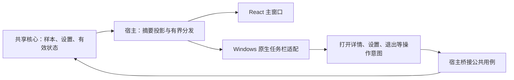

# taskbar-display

> 当前工作版本：v0.1.3
>
> 状态：2026-09-17 已接入首批实现，系统兼容、完整生命周期与视觉验收未完成。普通权限原生探针已在 Windows 11 25H2 / 200% DPI 显示双行、单行及提示；管理员宿主联动未验证。沿用当前工作版本，不追溯增加原主窗口发行门槛。

## 目标与范围

- v0.1.3 P1：网速可关闭，CPU/GPU 使用率与温度独立开关，支持四类指标组排序及指定显卡。启用任务栏时至少保留一个指标；指定显卡暂时不可用时保留选择并显示缺失状态。旧配置按原 cpu/gpu 分组开关迁移温度选项，保持旧外观。
- 原生与设置预览使用相同的分组顺序：上下行是一组，其余指标按顺序双行配对；空间不足优先保留最前的一组，仍放不下就隐藏并说明。沿用 Sakani 字体、变量、控件和状态；不增加采样源，不更换原生绘制方案。

- v0.1.2 P0 常驻优化：任务栏关闭时跳过全部读数投影和 GPU 快照复制，托盘恢复与操作处理照常工作；开启后只移动所需摘要，不额外克隆。采集重启后全局菜单监听只注册一次，发送目标切换到当前队列，避免失败重试积累失效回调。保持单一采样、原有 100 ms 轮询间隔和现有过期/兼容性规则。

- 在 Windows 任务栏内直接显示实时读数，不打开主窗口也能查看；与主窗口消费同一份后端样本、网卡选择和有效状态。
- 首期验证 Windows 11 原生水平主任务栏，提供网速、CPU/GPU 使用率与温度、内存、设置及恢复入口。Windows 10、第三方任务栏、竖向任务栏及副屏直显分别后置，不宣称兼容。
- 2026-09-17 用户授权开始实现。先验证原生嵌入，再接真实数据、正式绘制和常驻生命周期；按原任务计划记录实测范围与未验证项。
- 多屏同时显示、趋势曲线、悬浮窗、托盘详情面板、自由皮肤与开机启动后置。后续增加硬件指标只消费现有来源，不建立另一套采集。
- 公共约束：[产品设计](../../design/product-design.md) 第 5.4 节、[技术架构](../../architecture/overview.md)、[Windows 调研](../../research/windows-monitoring.md)。TrafficMonitor 是技术参考；Sakani 决定视觉与组件状态；[HTML 预览](../v0.1.0-main-window/assets/main-window-preview.html) 仅提供主窗口结构参考，不定义任务栏外观。

## 技术方案

- 2026-10-04 恢复补强：原生线程因窗口重建或绘制错误结束后，由宿主统一按有限频率指数退避重试，同一设置版本也可恢复；禁用后停止，成功显示或新配置重置等待。UIA 初始化失败和线程异常结束必须返回明确错误，不能永久停在连接中。UIA 遍历设置总耗时预算并检查停止请求。托盘周期检查同时更新就绪与失败状态；丢失入口时恢复可见、可操作且位于屏幕内的主窗口，不主动请求焦点。紧凑降级说明以实际保留指标组为准。沿用原生 Sakani 视觉和既有布局，不改网络控制或显式退出清理。

- 系统字体样式扩展：全局 `font_style` 与家族一起进入摘要和布局失效条件；DirectWrite 使用实际 weight/style/stretch，鸿蒙三份原字库内嵌。系统家族或显式样式失效时回退鸿蒙 Regular，保留请求并在状态说明；不产生伪粗体选项，字体目录由 [preferences](../v0.1.0-preferences/design.md) 按需读取。

- 2026-10-03 全局字体沿用 [preferences](../v0.1.0-preferences/design.md)：HarmonyOS Sans SC 默认，Geist 与系统默认可选，覆盖下文早期固定 Geist 的说明。摘要携带已确认字体偏好；变化时重建读数和自绘提示字体、清除旧测量再布局。鸿蒙原始 Regular 内嵌，系统默认从 Windows 非客户区消息字体解析；其余 Sakani 样式和固定数值列规则不变。

### 现状与路线

现有 `host/src/runtime.rs` 管理基础采样与主窗口订阅；主窗口隐藏/最小化后停止其推送及按需应用网络排行，基础采样继续。`core/src/ports.rs` 尚无桌面集成端口，架构中的 `DesktopIntegration` 是设计约定，不能当作现成实现。任务栏需要独立的摘要消费者，不能放在当前 `if visible` 的主窗口推送分支内。

| 路线 | 适用性 | 本功能处理 |
| --- | --- | --- |
| Win32 原生子窗口嵌入 Explorer | 满足任务栏内持续文字显示；依赖系统窗口结构 | 当前采用；Windows 11 UIA 结构与 DPI 实际探测 |
| Tauri WebView 窗口嵌入 | 引入另一份 WebView 生命周期、绘制与资源开销 | 主窗口继续用 React，任务栏读数采用原生绘制 |
| 托盘图标、应用按钮覆盖图标/进度 | 可提供恢复和状态入口，不能代替多项文字直显 | 托盘作为常驻恢复入口；直显失败单独报告 |
| AppBar 或悬浮窗 | 独立屏幕边缘区域/桌面窗口 | 属于其他产品形态，不作为任务栏验收替代 |

2026-09-17 复核的依据：TrafficMonitor [V1.86 TaskBarDlg.cpp](https://github.com/zhongyang219/TrafficMonitor/blob/V1.86/TrafficMonitor/TaskBarDlg.cpp) 使用原生窗口嵌入，并有多种绘制路径；[Win11TaskbarDlg.cpp](https://github.com/zhongyang219/TrafficMonitor/blob/V1.86/TrafficMonitor/Win11TaskbarDlg.cpp) 按开始按钮、通知区和任务栏对齐方式定位。其副屏存在固定空间回退，Pinmeter 不照搬这些像素假设。微软 [Taskbar Extensions](https://learn.microsoft.com/en-us/windows/win32/shell/taskbar-extensions) 与 [AppBar](https://learn.microsoft.com/en-us/windows/win32/shell/application-desktop-toolbars) 文档描述的是不同能力；从这些来源推断，原生嵌入需作为兼容适配维护，不能视作系统承诺的任意文字插槽。

### 系统适配与可行性门槛

1. **定位**：查找 `Shell_TrayWnd` 并验证所属 Explorer、窗口有效性、当前显示器和实际边界。以通知区左侧为首个候选位置；获取应用按钮、小组件、开始、搜索、系统托盘和时钟的占用区域。子窗口边界不足时再在原型中评估只读 UI Automation；UIA 容器边界不等于可用区域。无法可靠确认空隙时返回“无法确定可用位置”，不猜固定偏移。
2. **嵌入**：创建自有 Win32 子窗口并设定样式，按系统结构挂接；不注入 Explorer、不加载 Shell 插件、不更改系统任务栏配置。第一阶段不移动或缩小 Explorer 自身控件。这意味着图标密集时可能没有展示空间，必须如实降级。
3. **DPI 与权限**：微软 [SetParent](https://learn.microsoft.com/en-us/windows/win32/api/winuser/nf-winuser-setparent) 明确说明该调用不自动切换窗口样式，跨进程 DPI 模式不一致可能重置子窗口进程的 DPI 感知。当前 `platform/src/startup.rs` 会在 Windows 启动时统一提权，须验证与通常普通权限的 Explorer 的嵌入、输入、系统广播和 UIA 行为，不沿用“宿主一定普通权限”的早期假设。先用独立小程序验证；不得为了嵌入重置正式主窗口进程的 DPI 模式。
4. **装配决策**：原型证实当前宿主 DPI/权限组合安全后，首选同进程独立 UI 消息线程；若会影响 Tauri 主窗口，则使用仅绘制的独立 helper 隔离。helper 不采样、不加载 Tauri，只收有界摘要并回传有限操作；按会话/进程身份约束 IPC，主进程退出后销毁。若需普通权限启动，必须先验证受限启动与 IPC 方案，不直接继承提权 token 后宣称已隔离。正式兼容验收必须覆盖宿主实际权限。当前研究实现采用同进程原生线程，普通权限探针通过，管理员探针的 UAC 操作被取消；这不满足正式宿主可用性门槛，不据此宣称已完成路线验收。
5. **绘制**：采用 Direct2D DC render target + DirectWrite，将 32 位位图提交给 layered child window；宿主和探针 manifest 声明 Windows 8+ 支持。HWND render target 在当前 Explorer 子窗口中未得到可见画面，因此不作为当前渲染路径。按 2026-09-17 用户反馈改为全透明读数背景：清屏使用预乘 RGBA 全零，仅文字、图标及键盘焦点描边输出非零 alpha；悬停通过标签/单位前景强调，取消底色。DirectWrite 显式使用灰度抗锯齿，避免透明边缘依赖实色底板。独立 Tooltip 仍使用 Sakani 提示表面。设备丢失时重建绘图资源，失败保留可解释的不可用状态。原生字体须打包可供 DirectWrite 读取的 Geist 资源并保留许可，不能默认系统已安装或直接使用 Web 的 WOFF2。
6. **变化与恢复**：以窗口/显示环境事件触发布局，合并连续变化并辅以有上限的低频检查。Explorer 重启、任务栏重建、DPI/主屏切换、自动隐藏、对齐方式及主题变化后重新探测。旧 HWND 全部失效后再建立新实例；使用代次避免迟到回调操作新窗口。指数退避且限定频率，禁止逐采样重建窗口。
7. **隐藏**：任务栏自动隐藏时读数同步隐藏，不占据展开热区；全屏时遵循任务栏可见性，不额外置顶。停止绘制仍接收最新有效状态，恢复只画最新帧。布局不可靠时隐藏读数，保留恢复入口及设置里的原因。

上述原型的通过条件是：无系统控件遮挡、无主窗口 DPI/输入副作用、隐藏与恢复正确、退出可清理；不能仅以 `SetParent` 返回成功判断通过。

### 当前实现边界

- 主屏只接受 Explorer 的 Windows 11 `TaskbarFrame`，从其 UIA Button 取得实际占用区并整体保留 `TrayNotifyWnd`；不使用旧 `MSTaskListWClass` 的宽度推断 Win11 空隙。明确结构不支持、窗口/边界变化时隐藏直显并报告原因；检测超时本身不触发隐藏。
- UIA 位于独立 COM 线程，仅查询任务栏 frame，避免 UI 线程查询自有窗口导致死锁/超时；设置 200 ms 连接/事务超时和每轮 1 秒遍历预算，调用前后检查取消；单次 COM 阻塞仍受系统能力限制。WinEvent 合并后最密 500 ms 触发检测，正常辅以 2 秒检查；失败统一按 1/2/4/8/16/30 秒封顶退避，事件不绕过失败等待，配置改变可立即重试。新观察直接交给显示线程；无布局变化不移动窗口，无数据/状态变化不请求绘制。
- 2026-09-18 用户进一步要求超时不得闪烁：取消已显示位置的 4 秒隐藏期限。UIA 连续失败、观察暂停或结果过期时，只要已显示窗口仍通过 Explorer HWND/PID、可见性、任务栏边界、DPI 及下述通知区避让复核，就保持原位置持续更新，不隐藏、重建或移动窗口。4 秒仅用于判断新观察能否作为首次/重新定位依据；失败和复用不伪造新的成功时间。首次启动没有可信位置时继续等待，明确结构不支持、自动隐藏、窗口销毁、任务栏边界变化或空间不足仍按实际状态处理；任务栏设置变化和绘制故障不沿用旧位置缓存。UIA 未恢复期间，Win32 边界未反映的按钮占位变化仍待后续成功检测确认，不宣称已覆盖全部系统场景。
- 位置检测与指标采样独立：位置超时不改写正常指标。采样失败/过期沿用核心状态，仅对应数值显示 `—`，CPU/GPU 温度可独立失效；保持名称、槽宽与布局，不能整块隐藏或显示为真实零值。检测恢复后在原窗口更新；新布局确实变化才重排。
- 2026-09-18 补充：暂空/未就绪的 UIA 按钮树按检测失败重试，不直接判定永久不支持。通知区尺寸变化时，新布局仍要求当前且新鲜的完整观察；已显示区域可在 Explorer HWND/PID、任务栏边界、可见性及 DPI 不变，且实际子窗口仍完全处于任务栏内、与当前通知区保留间距的情况下原位更新数据。保留结果不能用于创建、移动、改尺寸或主题重排；得到新观察后再更新布局。通知区确实侵入、原生身份/边界变化、明确不支持仍隐藏。仅 taskbar 设置变化使旧布局失效，其他设置 revision 只更新状态回执。
- 摘要单槽只保留最新结果，有限操作队列容量 16。配置版本、会话、帧序号、网卡 ID 和有效时间保留在项目类型中；读数使用核心 `latest_at`，不会因主窗口隐藏而暂停任务栏更新。主窗口与任务栏复用速度格式，在 999.95 的舍入边界提前升单位，最高单位使用 `999+` 保持固定宽度。
- 设置复用现有保存用例；旧 schema 1 缺少 taskbar 时默认关闭。原生线程失败保留原因，同配置也按受控退避重试，关闭后停止；成功显示复位等待。托盘通过 Tauri 建立，Windows 每 5 秒检查其矩形，恢复时同步就绪和错误状态；入口失效先无激活地恢复可见主窗口，再尝试重建。显式退出沿用原网络规则清理，本轮不修改其实现。
- Geist 来自当前前端同版本字体包，转换为 DirectWrite 可加载的 TTF，随平台资源携带 OFL；不安装到系统。颜色由 `tools/sync-taskbar-tokens.mjs` 从已固定 Sakani tokens 提取，`tools/dev.ps1 check` 检查漂移。
- 当前原生可访问名称提供各项值/单位/状态，支持回车/空格和托盘替代入口；完整 UIA 操作 Provider、系统键盘焦点顺序、高对比度、文字缩放以及原生浅色 Tooltip 仍未验收。自动隐藏的边界检测已编码，实际自动隐藏/全屏、Explorer 重启和混合 DPI 仍待实测。

### 透明合成与输入边界

使用现有 `UpdateLayeredWindow / AC_SRC_ALPHA` 逐像素合成，保持整体 alpha 255，背景像素 alpha 0，不能通过降低整窗透明度让文字一起变淡。微软 [alpha 模式说明](https://learn.microsoft.com/en-us/windows/win32/api/dcommon/ne-dcommon-d2d1_alpha_mode) 描述了透明目标的灰度文字抗锯齿；[layered window 说明](https://learn.microsoft.com/en-us/archive/msdn-magazine/2009/december/windows-with-c-layered-windows-with-direct2d) 明确全透明像素鼠标穿透。当前读数文字/图标可悬停与点击，字间透明空隙将消息交还任务栏；托盘菜单保留完整恢复和设置入口。验证真实位图的透明边距、悬停不填底、文字预乘 alpha、重绘清除旧帧及独立 Tooltip 表面，不能仅凭设置页截图判定原生透明通过。

### 分层、数据与状态



- `core`：增加少量桌面设置、摘要与能力结果类型，管理期望设置和实际状态；保持无 Tauri/Win32 依赖。摘要包含会话、序号、配置版本、指标/设备身份、值、单位、有效采样时间与状态。
- `host`：从现有快照投影摘要并装配桌面入口；向原生线程提交“仅保留最新一帧”的有界消息，不在状态锁内绘制或等待 Explorer。React 与原生端的格式规则用相同样例核对，避免单位及舍入分歧。
- `platform`：使用 `src/backend/platform/src/taskbar/`，封装 Windows 定位、绘制、消息循环、UIA、能力探测；纯核心契约放 `core/src/desktop.rs`，装配放 `host/src/desktop.rs`。实际模块按上述归属实现，不重构无关采集文件。三 crate 依赖不变，Windows SDK 通过条件编译隔离。
- `frontend`：复用 `features/settings` 的 View/ViewModel 与客户端，展示保存结果、能力和生效原因；View 不调用 Tauri 命令。类型沿用宿主契约导出流程。
- 状态分为：关闭、正在连接、已显示、因任务栏隐藏而暂隐、空间不足、正在恢复、环境不支持、连接/绘制失败。保存了“启用”不等于已经显示；失败不清除用户偏好。回执携带配置版本，旧操作迟到后仍需向最新偏好对齐。
- 任务栏按既有 1/2/5 秒采样间隔更新，不单独计算 CPU 或网速，不唤醒应用网络排行、IP 查询或新传感器。没有新帧时，仍按核心有效性规则更新过期状态，不能永久保留正常旧读数。

### 生命周期与退出

2026-09-17 最新用户要求覆盖原自动收起规则：关闭窗口默认询问最小化或退出，并支持记住选择；设置页可改回每次询问。最小化收起到托盘，隐藏系统任务栏按钮；隐藏前确认托盘恢复入口可用，任务栏显示开关不改变关闭选择。关闭状态、持久化及验收由 [desktop-runtime](../v0.1.0-desktop-runtime/design.md) 维护。

任务栏仍提供托盘恢复/退出菜单。关闭任务栏直显时保留托盘入口和窗口当前显隐；Explorer 重启后重建托盘与任务栏，恢复失败保留可操作入口。用户主动操作之外的恢复不抢焦点。隐藏任务栏读数与关闭整个功能仍是不同操作。

设置开关及选项操作后立即保存生效，失败回到已确认值并显示错误；不再要求点击“应用”。期望启用与原生实际显示仍分开，不能把预览当作原生成功。托盘始终独立建立，关闭直显不移除恢复入口；收起到托盘与关闭选择由 desktop-runtime 维护。

所有“退出 Pinmeter”操作复用现有 `host/src/exit.rs` 的网络限制清理流程；收起窗口不触发退出清理，限速/禁用继续按已确认配置工作。清理失败或需要确认时恢复主窗口呈现原有退出状态，不留下不可操作的后台进程。进程最终退出前释放原生窗口、事件钩子、绘图对象和可能存在的 helper。

## 本批 CPU / GPU 组合读数

- 2026-09-17 用户选定 `CPU 2% (57°C)`；GPU 使用相同格式，括号温度稍弱化。背景继续全透明，按最大读数保留整组宽度，名称、数值列与温度列位置固定。使用率、温度均取整数，温度缺失/失败/过期显示 `(—°C)`，不掩盖仍有效的使用率。
- 复用核心 CPU 温度和 GPU 快照，不新增采集或按窗口重复启动 helper。摘要分别保留使用率与温度的状态、有效时间和原因；Tooltip 展示设备、测温点与来源。GPU 核心温度缺失时沿用现有 GPU 页的 VR SoC 规则，短格式加 `*`，提示明确其不是核心温度；临时失败不切换测温点。
- 多显卡默认按现有 GPU 页默认规则选择显存容量最大设备，任务栏会话内固定设备身份，不随负载或临时采集失败跳卡；设备消失后重选。Tooltip 显示名称。GPU 页手动选择仍仅作用于详情页，不新增设备配置。
- 默认双行：第一列下载/上传，第二列 CPU/GPU，第三列内存（首行）。CPU、GPU、内存可分别取消，CPU/GPU 温度随对应指标一起显示；只有 CPU 或 GPU 时与内存组成两行，避免不必要的空列。单行仍横排，空间不足沿用仅上下行的明确降级，不覆盖系统按钮。
- 设置增加默认选中的“GPU 使用率与温度”，CPU 改称“CPU 使用率与温度”，保持点击立即保存和失败回滚；旧配置缺少 GPU 字段按默认开启兼容，保留其余偏好。预览同步，原生点击 GPU 进入 GPU 页，托盘补充同一入口。
- 验证正常/零/缺失/过期的组合读数、GPU 身份稳定和 VR SoC 标识，覆盖全部勾选组合、单双行、深浅主题和 100%/150%/200% 位图布局/透明回归，构建完整直接运行包。

```text
↓ 3.2 MB/s     CPU  2% (57°C)     内存 44%
↑ 128 KB/s     GPU 18% (49°C)
```

## 界面展示

### 信息布局与尺寸

以下都是结构示意及示例数值，不是最终视觉稿。用户已选择双行紧凑为默认，显示下载/上传、CPU/GPU 及内存；单行为可选布局，“仅网速”通过取消 CPU/GPU/内存实现。

```text
双行紧凑：
↓  3.2 MB/s     CPU  2% (57°C)     内存 44%
↑  128 KB/s     GPU 18% (49°C)

单行横排：
↓ 3.2 MB/s   ↑ 128 KB/s   CPU 2% (57°C)   GPU 18% (49°C)   内存 44%

仅网速：
↓  3.2 MB/s
↑  128 KB/s
```

- 下载/上传成组；CPU、GPU、内存为可选组。本批增加 GPU 与 CPU/GPU 温度，暂不做任意拖拽编辑器。百分比显示整数、网速为十进制 B/s、KB/s、MB/s、GB/s 等，舍入沿用主窗口规则；不使用含糊的 `3.2M`。
- 等宽数字、标签左对齐；网速保留固定数值槽右对齐。按 2026-09-17 用户间距反馈，CPU/GPU/内存名称后保留 Sakani `space-4` 紧凑间距；按本次纠正，使用率恢复固定三位等宽数字槽并右对齐，百分号与括号温度起点固定，个位/两位/100% 均上下对齐；仍按最大值保留整组宽度，避免组和窗口在刷新时移动。字体、字重和单位样式来自 Sakani。保留固定数值/单位槽，按最大可呈现格式预先测宽。超大值进入更高单位或明确的上限格式，不截断关键单位，也不随数值涨跌改变窗口宽度。
- 默认无趋势线、无彩色负载条、无品牌标题、无外层大卡片；下载/上传箭头使用同一 Lucide 图标来源。原生业务布局可以定制，外观不得另起设计体系。
- 以官方现有排版档位组合原型：正文候选 14/20（字号/行高），两行连续排布，上下边距各取 `space-2`，组间距取 `space-12`，总高约 44 逻辑像素。只压缩容器留白，文字放大或实际任务栏高度不足时重新评估布局，不降低字号或裁切。宽度由字形测量产生，不提前承诺固定 160/200 像素。最终规格经 Sakani 与实际任务栏截图共同确认。
- 高度不足时采用能容纳的单行布局；宽度不足时先减少可选 CPU/GPU/内存组，保留下载/上传及状态。仍放不下则隐藏直显并报告“任务栏空间不足”。不悄悄只留一个方向，不覆盖其他按钮；仅在可用区域/配置变化时重排，恢复时加入防抖，避免显隐反复。

### 状态与交互

| 场景 | 展示与操作 |
| --- | --- |
| 正常（含真实零） | 正常数字和单位；CPU 高占用本身不变为错误色 |
| 预热 | 值槽显示 `—`，悬停/辅助名称说明“正在采样” |
| 断网、失败、权限不足、不支持 | 值槽 `—` 并有非颜色状态标记；悬停给出对应原因 |
| 过期 | 首期统一 `—` 加状态标记；提示上次有效时间，避免小空间里的旧值被误读为实时 |
| 悬停 | Sakani Tooltip：指标全名、网卡名称/统计范围、有效时间和异常原因；不加入趋势或更多操作 |
| 单击 | 网速组进入网络页，CPU/GPU/内存组进入对应详情；仅用户输入触发激活，不靠刷新抢焦点 |
| 右键 | 使用平台原生菜单：打开总览、任务栏设置、隐藏任务栏读数、退出 Pinmeter；隐藏前保证恢复入口 |
| 键盘与读屏 | 提供指标名称、值、单位、状态及操作；托盘菜单能打开同一详情/设置。原生 UIA 与焦点顺序纳入验证，避免逐秒实时播报 |

原生菜单遵循平台规范；应用自绘的读数、悬停反馈和提示遵循 Sakani。无效状态不只靠颜色，图标和 Tooltip 不把有效的 `0` 标为失败。

### 设置与视觉来源

设置页增加“任务栏显示”区：启用开关、布局、CPU/GPU/内存勾选、即时结构预览，以及“已显示 / 空间不足 / 正在恢复”等实际状态和简短原因。预览采用相同示例格式与行/分组规则，使用网页布局；原生宽度由 DirectWrite 单独测量，预览不承诺像素等宽，明确是预览；系统嵌入成功必须由后端回执确认。首期固定主屏，未实现的多屏或位置选项不展示。

任务栏默认按系统任务栏的深浅环境解析 Sakani 主题，主窗口继续使用其已确认主题设置；避免 Windows 应用浅色/任务栏深色混合设置下白字或黑字不可读。读数背景始终全透明，由系统任务栏负责背景合成；不再增加黑色或浅色底板，设置预览同步透明。文字继续使用 Sakani 对应主题前景变量，不采样桌面像素另造配色。

沿用主窗口的 `@sakaniui/react 0.3.1`、`lucide-react 1.46.0`、Geist `5.3.0`，tokens 来源提交 `0c9a97359001299a1e917ef67fdd0d5af99023a7`。实施时将原生需要的语义变量作为共享数据放在 `src/shared/design-tokens/` 并保留来源；不由 Rust 维护另一套手写颜色。原生字体格式转换/打包单独检查许可证及渲染结果。

| 用途 | Sakani 对照来源 | 必查状态 |
| --- | --- | --- |
| 总开关 | [Switch](https://main--6a5a658b3681fcc010430db5.chromatic.com/?path=/story/forms-switch--with-label) | Off、On、Disabled、Dark Mode、焦点 |
| 布局选择 | [Select](https://main--6a5a658b3681fcc010430db5.chromatic.com/?path=/story/forms-select--with-label) | Filled、Error、Disabled、Dark Mode、展开/焦点 |
| 指标选择 | [Checkbox](https://main--6a5a658b3681fcc010430db5.chromatic.com/?path=/story/forms-checkbox--with-description) | Checked、Unchecked、Disabled、Dark Mode |
| 读数说明 | [Tooltip / With Subtitle](https://main--6a5a658b3681fcc010430db5.chromatic.com/?path=/story/core-tooltip--with-subtitle) | 默认、悬停、Dark Mode、屏幕边缘定位 |

本轮查看官方 Storybook 并核对本地 tokens/依赖，具体来源截图及查阅范围见 execution。原生数字排版、主题匹配、全部控件状态均须在实现阶段逐项验收；来源截图不能证明 Pinmeter 视觉已通过。

## 验收

- **适配**：记录 Windows 完整构建、Explorer、主屏任务栏配置、权限和 DPI；验证居中/左对齐、图标增长、系统面板弹出、自动隐藏、全屏、Explorer 重启、主屏切换、休眠恢复。无可靠空隙时明确不可用，绝不遮挡。
- **数据**：同一会话及有效采样的各项读数与主窗口一致；1/2/5 秒设置生效；预热、真实零、失败、过期及网卡切换可区分。主窗口隐藏后任务栏仍刷新，恢复主窗口不增加采样源。
- **生命周期**：启用/禁用/临时失败/关闭主窗口/明确退出按选定方案运行；无恢复入口时不藏窗口。网络限制清理失败时仍能操作既有退出界面；退出无原生窗口或辅助进程残留。
- **视觉与可访问性**：Sakani 深浅主题、混合系统主题、悬停/焦点/禁用/错误、100%/150%/200% 与混合 DPI、文字缩放、高对比度、长数值及单位切换；截图保存本功能 assets 并记录差异。未完成来源核对或仍有偏差保持未通过。
- **资源**：对比任务栏关闭、任务栏显示且主窗口隐藏、主窗口与任务栏同时显示三种模式；记录 CPU、内存、唤醒与 GDI/USER 对象变化。隐藏停止绘图、无持续动画、队列有界、反复重建无增长；可行性阶段测基线后确定增量预算，未定预算不能标性能通过。
- **兼容声明**：Windows 11 构建逐项实测，其他平台只验证未引入依赖泄漏并报告直显不支持；不把跨平台编译通过、文档检查或模拟截图当作运行验收。
