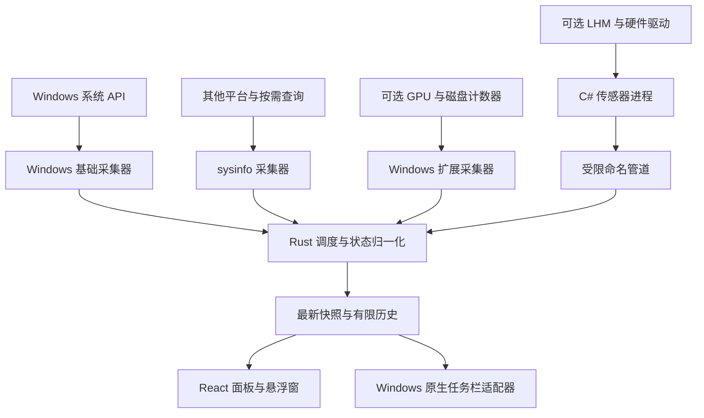

# Windows 性能采集方案调研与架构评审

[文档目录](../README.md) / 方案调研

> 调研日期：2026-09-16。依据 GitHub 官方仓库、固定版本源码、发布记录及微软文档。
>
> 本文是对 [设计文档](../design/product-design.md) 的补充。已完成资料与源码检查，尚未编译这些依赖或在本机运行对照测试；推荐方案、性能收益和设备兼容性仍需原型验证。

> 本文仅决定 Windows 适配器的候选实现。整体分层、MVC/MVVM 职责和跨平台代码边界以 [架构文档](../architecture/overview.md) 为准；Windows 深入验证的优先级不改变三平台从 M0 起共同设计的要求。

## 1. 结论

**保留 Tauri + React 的界面方向；在共享核心之外，为 Windows 适配器选择原生基础采集、通用库封装及可选硬件传感器实现。** macOS、Linux 使用平级适配器；`sysinfo` 是可复用工具，不是与 Windows 平台并列的架构层。

建议先采用以下边界：

| 职责 | 采用方式 | 理由 |
| --- | --- | --- |
| Windows CPU、内存、网卡流量 | Rust 经 `windows-rs` 调用少量系统 API | 能明确区分有效读数、首次采样和调用失败；保留稳定设备身份 |
| 其他平台基础指标；Windows 按需进程、磁盘容量 | `sysinfo` | 直接复用 Rust 跨平台库，减少重复实现 |
| Windows GPU 利用率、磁盘 I/O | 后续增加原生 PDH 采集器 | 基于系统计数器，不必先引入温度监控组件 |
| CPU/GPU 温度、主板风扇、功耗等 | 可选 C# 采集进程 + LibreHardwareMonitorLib | 复用硬件适配；独立处理运行时、驱动及权限 |
| 任务栏直接显示 | 参考 TrafficMonitor，开发独立原生窗口适配器 | 只消费统一快照，与采集解耦 |

上述组合是本次评审建议，尚未成为经过实测的最终选型。**每项指标只指定一个生产来源**，不会同时常驻运行两套基础采集；对照模式仅用于测试。

## 2. 值得关注的 GitHub 项目

成熟度判断依据包括实际使用场景、近期发布、Windows 实现、错误处理和平台适配；项目流行度不能代替准确性验证。版本及维护状态均为本次调研时的快照。

| 项目 | 核验的发布 / 维护证据 | 定位与技术 | 对 Pinmeter 的价值 |
| --- | --- | --- | --- |
| [sysinfo](https://github.com/GuillaumeGomez/sysinfo) | 已发布 0.39.6，2026-07-09 | Rust 跨平台采集库，MIT | 可直接集成；适合通用采集及按需查询，Windows 错误状态另行处理 |
| [windows-rs](https://github.com/microsoft/windows-rs) | 仓库 release tag `74`，2026-09-03；这是仓库标签，不是所有 crate 的统一版本 | 微软 Windows API Rust 绑定，MIT / Apache-2.0 | 接入 PDH、IP Helper 和内存 API 的基础；本身不负责采样算法 |
| [LibreHardwareMonitor](https://github.com/LibreHardwareMonitor/LibreHardwareMonitor) | v0.9.6，2026-02-14；2026-09 仍有设备支持提交 | C# 应用及可复用库，主库 MPL-2.0 | 温度、风扇、频率、功耗的优先候选 |
| [TrafficMonitor](https://github.com/zhongyang219/TrafficMonitor) | V1.86，2026-03-29 | C++ / MFC 桌面工具，Anti 996 v1.0 | 产品形态最接近；参考任务栏适配与基础采集 |
| [System Informer](https://github.com/winsiderss/systeminformer) | 4.0.26241.138，2026-08-29 | 主要使用 C 的 Windows 系统工具，当前仓库 MIT | 深层进程、GPU、设备采样的源码参考 |
| [windows_exporter](https://github.com/prometheus-community/windows_exporter) | 0.31.8，2026-07-22 | Go 的 Windows 指标导出程序，MIT | 借鉴计数器语义、GPU 实例维度和采集器拆分 |
| [psutil](https://github.com/giampaolo/psutil) | 发布记录为 7.2.2，2026-01-28；主分支 8.0.0 标为开发中 | Python / C 跨平台库，BSD-3-Clause | 适合写参考脚本；当前 Rust 架构无需为它额外引入 Python |

发布与版本证据：[sysinfo 版本标签](https://github.com/GuillaumeGomez/sysinfo/tree/v0.39.6)、[windows-rs tag 74](https://github.com/microsoft/windows-rs/releases/tag/74)、[LHM v0.9.6](https://github.com/LibreHardwareMonitor/LibreHardwareMonitor/releases/tag/v0.9.6)、[TrafficMonitor V1.86](https://github.com/zhongyang219/TrafficMonitor/releases/tag/V1.86)、[System Informer](https://github.com/winsiderss/systeminformer/releases/tag/v4.0.26241.138)、[windows_exporter](https://github.com/prometheus-community/windows_exporter/releases/tag/v0.31.8)、[psutil 发布记录](https://github.com/giampaolo/psutil/blob/master/docs/changelog.rst)。

### 2.1 sysinfo：成熟的通用库，但需要核对具体版本

有实际 Windows 使用项目支撑：跨平台监控工具 [bottom](https://github.com/ClementTsang/bottom) 声明支持 Windows；其当前 [Cargo.toml](https://github.com/ClementTsang/bottom/blob/main/Cargo.toml) 锁定 `sysinfo = 0.39.6`。bottom 自身已发布 [0.14.9](https://github.com/ClementTsang/bottom/releases/tag/0.14.9)。这说明集成路径已有先例，但不代表 Pinmeter 已通过验证。

核对 `v0.39.6` 的 Windows 实现：

- CPU：PDH 读取 `% Idle Time`，再用 `100 - idle` 得到占用率。[system.rs](https://github.com/GuillaumeGomez/sysinfo/blob/v0.39.6/src/windows/system.rs#L99)
- 内存：`GlobalMemoryStatusEx`；网络：`GetIfTable2` 的 64 位累计收发字节。[system.rs](https://github.com/GuillaumeGomez/sysinfo/blob/v0.39.6/src/windows/system.rs#L166)、[network.rs](https://github.com/GuillaumeGomez/sysinfo/blob/v0.39.6/src/windows/network.rs)
- 温度：Windows 实现查询 `MSAcpi_ThermalZoneTemperature`。它描述 ACPI 热区，不能仅凭此接口承诺 CPU 核心、GPU 和主板的完整温度覆盖。[component.rs](https://github.com/GuillaumeGomez/sysinfo/blob/v0.39.6/src/windows/component.rs#L260)
- GPU：本次检查时 `main` 已有 [gpu.rs](https://github.com/GuillaumeGomez/sysinfo/blob/main/src/windows/gpu.rs)，但已发布 `v0.39.6` 的模块与 feature 中没有此能力。评估依赖时必须区分开发分支与已发布版。[稳定版模块](https://github.com/GuillaumeGomez/sysinfo/blob/v0.39.6/src/windows/mod.rs)、[稳定版 Cargo.toml](https://github.com/GuillaumeGomez/sysinfo/blob/v0.39.6/Cargo.toml)

**影响本次选型的具体问题**：`v0.39.6` 的 CPU counter 读取失败分支返回 `Some(0.)`，上层随后按 `100 - idle` 计算。由此推断，某些失败可能被显示为 100% CPU；另一些刷新失败仅记录内部调试信息。该结论来自源码，尚未做故障复现。[cpu.rs 读取分支](https://github.com/GuillaumeGomez/sysinfo/blob/v0.39.6/src/windows/cpu.rs#L203)、[上层计算](https://github.com/GuillaumeGomez/sysinfo/blob/v0.39.6/src/windows/system.rs#L137)

这不是排除整个库的理由，但意味着外面简单包一层 `try/catch` 或检查数值范围，无法可靠恢复被隐藏的错误。Pinmeter 把“失败不伪装成真实数值”列为要求，因此建议首版 Windows 高频核心指标使用小型原生封装；若未来稳定版提供足够的错误信息，可重新比较。

### 2.2 LibreHardwareMonitor：温度与风扇优先看它

应集成 **LibreHardwareMonitorLib**，而非启动完整监控界面。其官方示例提供硬件分组启用和遍历方式，并说明部分传感器需要管理员权限。[开发说明](https://github.com/LibreHardwareMonitor/LibreHardwareMonitor#developer-information)

当前接入必须考虑：

- **它是托管 .NET 库**。建议用小型 C# executable 包装，通过本地通信交给 Rust；不能把该 DLL 当作普通 C ABI DLL 直接调用。[v0.9.6 项目文件](https://github.com/LibreHardwareMonitor/LibreHardwareMonitor/blob/v0.9.6/LibreHardwareMonitorLib/LibreHardwareMonitorLib.csproj)
- **驱动路径已变化**。v0.9.5 从 WinRing0 迁移到 PawnIO；v0.9.6 又包含 PawnIO 新版本兼容修复。需要驱动的传感器不能按“复制一个 DLL 就能在所有机器上读取”设计。[迁移记录](https://github.com/LibreHardwareMonitor/LibreHardwareMonitor/pull/1857)、[兼容修复](https://github.com/LibreHardwareMonitor/LibreHardwareMonitor/pull/2222)
- **驱动安装与实际加载是两种状态**。稳定版源码分别检查 `IsInstalled` / `IsLoaded`；应用应给出对应能力状态。[PawnIo.cs](https://github.com/LibreHardwareMonitor/LibreHardwareMonitor/blob/v0.9.6/LibreHardwareMonitorLib/PawnIo/PawnIo.cs)
- **稳定版尚不能假定 Native AOT 发布已验证**。先按普通 .NET 可执行文件估算包体与内存，再独立验证裁剪或 AOT。[稳定版项目文件](https://github.com/LibreHardwareMonitor/LibreHardwareMonitor/blob/v0.9.6/LibreHardwareMonitorLib/LibreHardwareMonitorLib.csproj)

集成时仅开启需要的硬件类别；普通权限主程序持续提供基础监控。硬件访问需要额外权限时，由独立进程处理，驱动缺失或读取失败只影响相应指标。独立进程只能隔离用户态故障，不能隔离内核驱动故障。

主库、PawnIO 模块和驱动分别有许可声明，不能把整套分发内容简写为“只有 MPL-2.0”。复用范围确定后按实际依赖记录许可证和通知文件。[LHM 第三方声明](https://github.com/LibreHardwareMonitor/LibreHardwareMonitor/blob/master/THIRD-PARTY-NOTICES.txt)、[PawnIO 许可](https://github.com/namazso/PawnIO#license)

### 2.3 TrafficMonitor：最贴近产品形态的参考

2026-09-17 任务栏专题复核已形成 [taskbar-display 设计](../development/v0.1.0-taskbar-display/design.md)。原生嵌入先验证当前提权宿主与 Explorer 的权限/DPI 组合；微软 [SetParent](https://learn.microsoft.com/en-us/windows/win32/api/winuser/nf-winuser-setparent) 说明跨进程 DPI 感知不一致可能重置子窗口进程的 DPI。Windows 11 V1.86 参考实现依赖任务栏内部窗口与回退偏移，Pinmeter 首期只在可可靠识别的主任务栏空隙显示；普通权限 Win11 25H2 / 200% 原生显示探针已通过，采用 UIA 实际占用区域与 Direct2D DC layered child；管理员宿主、完整兼容矩阵及资源预算仍待验证，记录见原功能执行文档，不将探针可行性视为完整兼容性通过。

V1.86 的 Lite 版已经增加 GPU 和硬盘利用率；固定版本源码分别使用 `GPU Engine` 与 `PhysicalDisk` 的 PDH counters。**GPU 利用率与 GPU 温度应分开选型。**[V1.86 发布说明](https://github.com/zhongyang219/TrafficMonitor/releases/tag/V1.86)、[GPU 采集](https://github.com/zhongyang219/TrafficMonitor/blob/V1.86/TrafficMonitor/PdhHardwareQuery/GpuUsage.cpp)、[磁盘采集](https://github.com/zhongyang219/TrafficMonitor/blob/V1.86/TrafficMonitor/PdhHardwareQuery/DiskUsage.cpp)

任务栏实现使用 `FindWindow` 定位 Explorer 任务栏，再用 `SetParent` 将原生窗口嵌入；经典任务栏和 Windows 11 分开处理。该路径值得做 Pinmeter 原型，但依赖 Explorer 窗口结构与布局，不能据此承诺所有版本稳定。[TaskBarDlg.cpp](https://github.com/zhongyang219/TrafficMonitor/blob/V1.86/TrafficMonitor/TaskBarDlg.cpp#L999)、[Win11TaskbarDlg.cpp](https://github.com/zhongyang219/TrafficMonitor/blob/V1.86/TrafficMonitor/Win11TaskbarDlg.cpp)

**视觉可独立优化**：用户认可参考任务栏技术实现，希望改善其显示样式。V1.86 已有 GDI、Direct2D 和 Direct2D + DirectComposition 绘制路径，不能将当前外观归因于“只能使用老式绘图”。Pinmeter 将系统适配、布局绘制、数据交互分开，具体方向见 [设计文档](../design/product-design.md) 第 5.6、9.3 节。[绘制实现](https://github.com/zhongyang219/TrafficMonitor/blob/V1.86/TrafficMonitor/TaskBarDlg.cpp#L94)

不宜直接照搬的地方：

- CPU 在 PDH 失败时回退至 `GetSystemTimes`；其中 Utility 和时间占比可能属于不同口径。Pinmeter 不应静默切换语义。[CPUUsage.cpp](https://github.com/zhongyang219/TrafficMonitor/blob/V1.86/TrafficMonitor/PdhHardwareQuery/CPUUsage.cpp)
- GPU 源码按实例名称最后一段分组求和后取最大值，会丢失显卡与引擎身份。由此推断，多显卡或同类型多引擎存在混加风险，需要独立验证，不能把源码注释当作精准性的证据。[GpuUsage.cpp](https://github.com/zhongyang219/TrafficMonitor/blob/V1.86/TrafficMonitor/PdhHardwareQuery/GpuUsage.cpp#L25)
- 网络使用旧 `GetIfTable` 与 `dwInOctets` / `dwOutOctets`，Pinmeter 应采用 64 位接口计数。[TrafficMonitorDlg.cpp](https://github.com/zhongyang219/TrafficMonitor/blob/V1.86/TrafficMonitor/TrafficMonitorDlg.cpp)

它是完整的 C++/MFC 应用，适合参考接口选择和兼容经验；整套嵌入 Rust 项目成本较高。其许可是 **Anti 996 v1.0 (Draft)**，不是 MIT。[LICENSE](https://github.com/zhongyang219/TrafficMonitor/blob/V1.86/LICENSE)

### 2.4 System Informer 与 windows_exporter：参考采集设计

**System Informer** 值得研究 GPU adapter / node / segment 身份，以及网络、磁盘和进程采样。它的 provider、phlib/phnt、插件与 NT API 关联较深，适合作为源码参考；首版无需引入完整应用或内核组件。[GPU 实现](https://github.com/winsiderss/systeminformer/blob/58da5d7674a8ff86226dacd22e17e2d9885860dc/plugins/ExtendedTools/gpumon.c)、[系统采样](https://github.com/winsiderss/systeminformer/blob/58da5d7674a8ff86226dacd22e17e2d9885860dc/SystemInformer/procprv.c)

它的内核组件有调用者验证要求，不能当成任意客户端都能直接使用的通用驱动。Pinmeter 的基础监控不依赖这条路径。[内核组件说明](https://github.com/winsiderss/systeminformer/blob/58da5d7674a8ff86226dacd22e17e2d9885860dc/KSystemInformer/README.md)

**windows_exporter** 的 GPU collector 保留 LUID、物理适配器、引擎和进程维度；CPU 文档区分时间计数与 Utility，适合作为指标命名和聚合的参考。[GPU collector](https://github.com/prometheus-community/windows_exporter/blob/v0.31.8/internal/collector/gpu/gpu.go)、[CPU 文档](https://github.com/prometheus-community/windows_exporter/blob/v0.31.8/docs/collector.cpu.md)

它本身是 HTTP exporter，默认端口 `9182`，MSI 采用 Windows 服务部署；采集器位于 Go `internal` 包。对于本机桌面小工具，另起服务、解析 Prometheus 文本会增加进程管理和转换工作，因此建议借鉴实现，不默认捆绑运行。[v0.31.8 README](https://github.com/prometheus-community/windows_exporter/blob/v0.31.8/README.md)

### 2.5 其他候选的边界

- **psutil**：适合制作基础 CPU / 内存 / 网络对照脚本。其温度 API 标为 Linux / FreeBSD，风扇 API 标为 Linux，不能把这些接口作为 Windows 传感器方案。[API 文档](https://github.com/giampaolo/psutil/blob/master/docs/api.rst)
- **原版 OpenHardwareMonitor**：本次核验最后提交及官网最新版本为 2020-12-27；新项目优先评估仍在适配新设备的 LibreHardwareMonitor。[原仓库最后提交](https://github.com/openhardwaremonitor/openhardwaremonitor/commit/09c16898a4a84c36644e7c07baebf1efd299691e)、[官方发布页](https://openhardwaremonitor.org/)
- **NVIDIA NVML**：官方 C API 可作为特定 NVIDIA 指标的后续来源，但能力依赖设备与驱动，不能替代全厂商方案；官方 `go-nvml` 包装声明只支持 Linux，不应误选为 Windows 现成库。[NVML](https://docs.nvidia.com/deploy/nvml-api/nvml-api-reference.html)、[go-nvml](https://github.com/NVIDIA/go-nvml)

## 3. 修订后的采集架构

### 3.1 统一接口，逐项保留状态

内部接口建议围绕 `capabilities()`、`sample(request)`、`reset_baseline(reason)` 三类操作组织，无需首版建立通用插件系统。

每项样本包含：

- `metric_id`、设备标识、单位、值或空值。
- `source`、来源版本、`semantic_id`，例如 CPU 忙碌时间与 Utility 使用不同标识。
- 有效采样时间、请求/完成时间，以及计算速率实际使用的单调时间差。
- `status` 和原因码，区分预热、不支持、权限不足、驱动缺失、超时及读取失败。

**一次轮询返回，不等于获得了新样本。** 无法确认采集成功时不能推进有效采样时间，也不能用更新时间包装缓存值。来源改变时重建基线，不把不同口径拼成一条连续曲线。

界面推送可以合并为最新快照，但历史采样仍保留在后端有限缓存中。前端根据会话、订阅的补齐标记及历史覆盖边界补取样本；超出缓存范围的部分标记缺失，避免推送合并静默丢掉短时峰值。批次确认与历史游标分别处理，具体协议以架构文档为准。

### 3.2 首版 Windows API 映射

| 指标 | 建议来源 | 必须处理 |
| --- | --- | --- |
| CPU 总占用 | PDH `\Processor Information(_Total)\% Processor Time`，实际可用性在启动时探测 | 前后两次采样；调用结果与 counter 状态；整机 0–100% 口径 |
| 物理内存 | `GlobalMemoryStatusEx` | 成功标志；已用 = 总量 − available；不与提交量混淆 |
| 网卡收发 | `GetIfTable2` / `MIB_IF_ROW2` 的 `InOctets` / `OutOctets` | 64 位差分；真实间隔；接口 GUID/LUID 映射；移除与重连 |
| 磁盘容量 | `sysinfo::Disks` 按需刷新 | 区分卷容量与物理盘性能；确认失败可见性，不满足时采用更薄的原生接口 |
| 进程列表（后续） | `sysinfo` 按需刷新 | PID 复用、采样口径、进程退出和访问受限 |

微软 API 支持读取当前物理内存状态；`MIB_IF_ROW2` 提供接口身份、连接状态与 64 位字节计数，并明确接口 index 可能变化，不能用作持久身份。[GlobalMemoryStatusEx](https://learn.microsoft.com/en-us/windows/win32/api/sysinfoapi/nf-sysinfoapi-globalmemorystatusex)、[MIB_IF_ROW2](https://learn.microsoft.com/en-us/windows/win32/api/netioapi/ns-netioapi-mib_if_row2)

首版不承诺数值与任意版本任务管理器逐帧完全相同，而是固定忙碌时间口径并按相同来源、时间窗验证。若后续提供 Utility，作为单独语义呈现。`GetSystemTimes` 可用于特定回退研究，但其 kernel 时间包含 idle，且超过 64 个处理器时有处理器组范围限制，不能简单套一个公式就宣称覆盖整机。[GetSystemTimes](https://learn.microsoft.com/en-us/windows/win32/api/processthreadsapi/nf-processthreadsapi-getsystemtimes)

### 3.3 PDH 采集规则

PDH 是 Windows 的性能数据查询接口。Pinmeter 只为所需指标建立查询，并复用句柄。

1. 使用 `PdhAddEnglishCounterW` 处理系统语言差异；通配实例按文档处理枚举与动态变化。[接口文档](https://learn.microsoft.com/en-us/windows/win32/api/pdh/nf-pdh-pdhaddenglishcounterw)
2. 需要差分的 counter 至少取得两次样本，首个间隔显示预热；1 秒默认周期与官方采样示例一致。[采样说明](https://learn.microsoft.com/en-us/windows/win32/perfctrs/collecting-performance-data)
3. 同时检查函数返回码和每个值的 `CStatus`，不能只看 API 是否成功。[状态说明](https://learn.microsoft.com/en-us/windows/win32/perfctrs/checking-pdh-interface-return-values)
4. 实例消失、系统恢复、来源切换时重建对应基线；失败退避，不无限创建线程或查询对象。
5. CPU / 网卡与可能较慢的高级采集分开执行；统一调度不等于所有读取放在一个串行阻塞循环里。

### 3.4 GPU 和磁盘的后续扩展

- GPU 利用率先评估 Windows `GPU Engine` counters；按 adapter LUID、物理适配器和 engine 保留身份，同引擎的进程占用按验证后的规则归并。
- 每张 GPU 分别显示；卡级单值建议取该卡最忙引擎，不将不同引擎或多张卡直接相加。微软对任务管理器的说明采用最忙引擎表达总体负载，可作为对照依据。[微软 GPU 说明](https://devblogs.microsoft.com/directx/gpus-in-the-task-manager/)
- GPU 利用率、显存和温度各有能力状态；某张卡缺温度不应导致负载读数一并消失。
- 2026-09-16 已完成 [GPU 小范围实机验证](../development/v0.1.0-gpu-monitoring/execution.md)：普通权限的 LHM 0.9.6 可读取本机 RTX 5070 Ti 的四类指标，AMD 核显可读取负载、内存与频率，但只暴露 VR SoC 温度，不能当作核心温度。LHM/NVAPI 的 NVIDIA 已用显存与同期 NVML 参考有持续差异，Windows 显存统计仍需单独固定口径；当前已有 PawnIO，未验证无驱动环境或受控负载。
- 同日后续正式实现采用 LHM 暴露的 D3D 最忙引擎与 Dedicated/Shared Used，避免新增重复的 PDH GPU 来源；容量单独展示，不与不同口径的已用内存计算比例。普通权限独立进程的 34 轮采集、30 秒设备重枚举、正式窗口双卡展示通过；GPU 核心温度仍不回退至 SoC。早期 PDH 路线保留为研究候选，当前方案与边界以 [GPU 设计](../development/v0.1.0-gpu-monitoring/design.md) 为准。
- 磁盘区分容量、读写字节速率、忙碌比例以及逐进程 I/O；不把 `_Total` 当成某一块盘。只有需要逐进程事件追踪时才进一步评估 ETW。

### 3.5 可选传感器进程

- 用户未启用温度/风扇等能力时不启动 helper，也不要求安装 PawnIO。
- helper 只暴露读数，不暴露风扇控制、任意命令或任意驱动访问；主 UI 保持普通权限。
- 需要不同权限进程通信时，使用限制到预期用户/进程的命名管道，验证连接方与协议版本，限制消息大小和允许操作。
- helper 常驻复用硬件实例，建议从 2–5 秒周期起测；单次超时不影响基础数据，限制重启次数并退避。
- 进程退出或失去连接时传感器标记失效；重连重建会话和基线。需显式处理主进程退出后的 helper 清理。
- .NET 发布方式、LHM 版本、PawnIO 兼容版本和硬件型号一同记录；实际启用的传感器进程计入 Pinmeter 总开销。

## 4. 对原设计的修订

| 原设计中的不足 | 本次修订 |
| --- | --- |
| 只写“Rust + sysinfo”，Windows 数据来源与失败语义不够具体 | 明确原生核心指标、通用库与扩展采集器职责 |
| “库支持温度”容易被理解为完整硬件覆盖 | 区分 ACPI 热区、GPU 利用率和硬件温度/风扇 |
| 单套采样任务容易实现为所有指标串行阻塞 | 统一调度、独立执行、同一指标单一生产来源 |
| 任务栏仅停留在待研究 | 已找到 TrafficMonitor 的原生窗口路线，继续按 Windows 版本验证 |
| 将库调用结束当作采样成功会掩盖失败 | 保存有效时间、来源语义和独立错误状态 |
| 轻量预算只描述基础应用 | 开启传感器时单独报告 helper、运行时及总体开销 |

## 5. 下一步最小验证范围

先按架构文档固定共享模型、平台接口与三平台构建，再验证 Windows 采集与错误语义。以下保留 Windows 专项验证清单；当前 v0.1.0 主界面优先，界面演示开发与采集样例可并行，任务栏及高级指标后置。本次未执行这些测试。

1. **Windows 基础样例**：普通用户权限、1 秒周期输出 CPU / 内存 / 选定网卡的值、来源、时间和状态；独立检查数据来源后接入主窗口，无需先做进程全表或传感器进程。
2. **对照与故障测试**：与同时间窗参考数据比对；覆盖不存在的 PDH 实例、网卡禁用/重连、VPN 切换、休眠恢复。需要重现 sysinfo 错误路径时使用测试注入，不修改用户系统计数器配置。
3. **资源基线**：发布构建，分别测量主窗口可见与最小化时的基础采集、CPU、内存及绘图开销。
4. **任务栏独立原型（后续）**：只绘制静态或共享快照，验证 Windows 11、多屏缩放、自动隐藏、Explorer 重启；不重复采集，不作为 v0.1.0 交付门槛。
5. **按需求验证扩展**：GPU PDH 与 LHM 分别立项；LHM 必须实测需要的硬件、普通/额外权限、驱动缺失及总体资源开销。

**首版建议依赖最小化为 Tauri + React + Rust Windows API 绑定；按需加入 sysinfo。GPU、温度和风扇扩展各自通过验证后再进入发行范围。**
